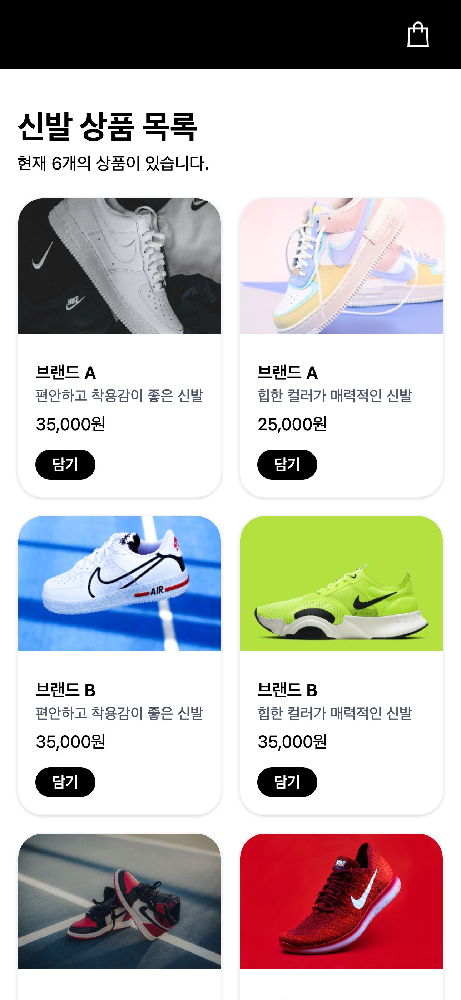
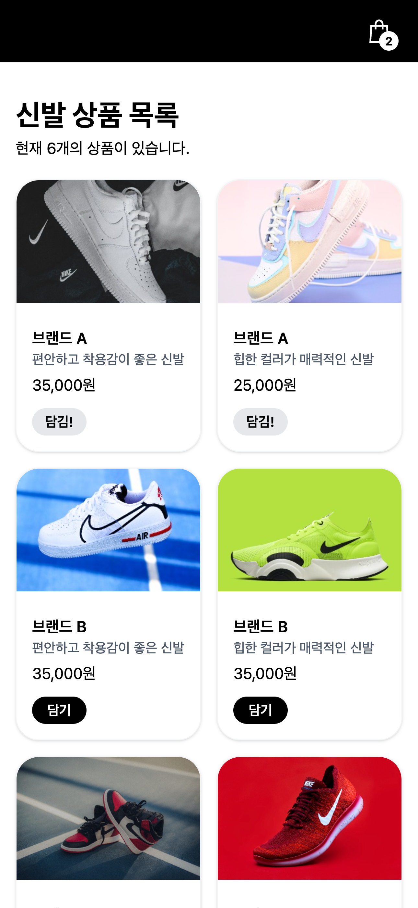

# 상품 목록 페이지 리뷰

### 배포 URL
- 상품 목록 페이지: https://hyeonw8.github.io/shooking/

## 고객사 요구사항
고객사에서 전달해주신 이메일 및 피그마 시안을 기반으로 아래와 같이 요구사항을 정리했습니다.

1. 주요 타겟층이 20~30대이며 모바일 이용 비중이 높기 때문에, 모바일 환경에서의 사용성을 최우선으로 고려해 구성해 주세요.
2. 신발 상품 사진이 디자인 시안처럼 충분히 크고 선명하게 보이도록 이미지 중심으로 구성해 주세요.
3. 각 상품 카드에는 디자인 시안을 참고하여 브랜드명, 상품 설명, 가격 정보, 장바구니 ‘담기’ 버튼이 포함되도록 해주세요.
4. 상품 목록 상단에는 페이지 제목과 함께 전체 상품 개수가 표시되도록 해주세요.
5. 장바구니에 상품을 추가하거나 제거할 때, 헤더 영역의 장바구니 아이콘에 담긴 상품 개수가 함께 변경되도록 해주세요.
6. 이미 장바구니에 담긴 상품은 버튼의 텍스트 및 스타일이 변경되어 담김 상태를 한눈에 구분할 수 있도록 해주세요.
7. 작업 결과물을 실제로 확인할 수 있는 테스트 URL을 제공해 주세요.

---

## 요구사항에 따른 기능 동작 확인

### 1) 모바일 환경 구성 (모바일 사용성)
✔ 모바일 환경에서도 편리하게 사용할 수 있도록 구성되었습니다.

- 모바일 화면 기준으로 화면 구성이 자연스럽게 표시됩니다.
- 상품 목록은 두 줄 형태로 정렬되어 한 화면에서 여러 상품을 쉽게 비교할 수 있습니다.
- 버튼과 텍스트가 화면 밖으로 잘리거나 겹치지 않도록 구성했습니다.
- 버튼을 누르면 바로 반응하도록 구성했습니다.

**확인 방법**
> 모바일 브라우저(모바일 사파리, 삼성 인터넷 등)에서 접속 후 ‘담기’ 버튼을 눌러보시면 즉시 반응하는 것을 확인하실 수 있습니다.

**실제 모바일 화면 (iPhone 14 pro 기준)**

모바일 화면에서 상품이 두 줄 형태로 정렬된 것을 확인하실 수 있습니다.

### 2) 신발 상품 사진(이미지) 중심 구성
✔ 디자인 시안을 기준으로 이미지 중심 레이아웃으로 구성되었습니다.

- 각 상품 카드 상단에 상품 이미지가 크게 배치되어 있습니다.
- 시안과 동일하게 이미지가 가장 먼저 눈에 들어오도록 구성하여 시각적 집중도를 높였습니다.
- 이미지가 카드 영역에 맞춰 잘리지 않고 자연스럽게 채워져 보이도록 구성했습니다.
- 동일한 카드 구조로 반복되어 상품 비교가 쉽도록 구성했습니다.

**확인 방법**
> 각 상품 카드를 확인하시면 이미지가 상단에 크게 배치되어 있으며, 스크롤 시에도 화면이 자연스럽게 유지되는 것을 확인하실 수 있습니다.

### 3) 상품 카드 구성 요소
✔ 요청하신 구성 요소가 모두 정상적으로 반영되었습니다.

각 상품 카드에는 다음 정보가 포함되어 있습니다.
- 브랜드명
- 상품 설명
- 가격 정보
- ‘담기’ 버튼

**확인 방법**
> 각 상품 카드에서 위 네 가지 정보가 모두 표시되는지 확인하실 수 있습니다.
  
### 4) 장바구니 기능 및 헤더 수량 실시간 반영
✔ 상품을 담거나 해제하면 장바구니 수량이 즉시 반영됩니다.

- ‘담기’ 버튼을 클릭하면 해당 상품이 장바구니에 추가됩니다.
- 버튼을 누르는 즉시 상단 장바구니 아이콘 옆 숫자가 함께 증가합니다.
- 이미 담긴 상품은 버튼이 ‘담김!’으로 변경되어 구분됩니다.
- 다시 누르면 장바구니에서 제거되며 숫자가 감소합니다.
- 담김 여부가 버튼의 문구와 색상으로 구분됩니다.
  - 미담김: 담기
  - 담김: 담김!
- 장바구니에 담긴 상품이 없을 경우 숫자는 표시되지 않습니다.

**확인 방법**
> ‘담기’ 버튼을 누르면 상단 장바구니 숫자가 증가하고, 해당 카드의 버튼이 ‘담김!’ 상태로 변경됩니다.
다시 누르면 숫자가 감소하며 버튼도 ‘담기’ 상태로 돌아갑니다.

**🛒 담기 전 화면**

상품이 장바구니에 담기기 전 상태입니다.  
상단 헤더에 수량 표시가 없으며, 버튼은 ‘담기’ 상태로 표시됩니다.

---

**🛒 담기 후 화면**

상품을 ‘담기’ 버튼으로 추가한 이후의 화면입니다.  
상단 장바구니 아이콘 옆에 수량이 표시되며,  
해당 상품의 버튼이 ‘담김!’ 상태로 변경된 것을 확인하실 수 있습니다.

### 5) 상품 목록 상단 정보 표시
✔ 상품 목록 제목과 전체 상품 개수가 정상적으로 표시됩니다.

- 페이지 상단에 상품 목록 제목이 표시됩니다.
- 전체 상품 개수가 함께 노출됩니다.
  - 예: “현재 6개의 상품이 있습니다.”

**확인 방법**
> 페이지 상단에서 제목과 상품 개수를 확인하실 수 있습니다.

### 6) 배포 URL(테스트 URL 제공)
✔ 요청하신 대로 테스트 URL을 제공했습니다.

- 별도 설치 없이 웹 브라우저에서 바로 확인 가능합니다.
- 아래 링크 접속 후, 모든 기능의 실제 동작을 확인하실 수 있습니다.
- 배포 URL: https://hyeonw8.github.io/shooking/

---

### 참고 및 향후 개선 사항
- 현재 상품 데이터는 테스트용 데이터(mock 데이터)로 구성되어 있습니다.
- 장바구니는 새로고침 시 초기화됩니다. (추후 개선 가능)

