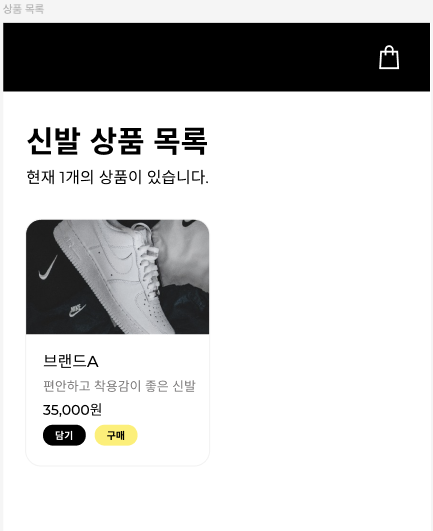
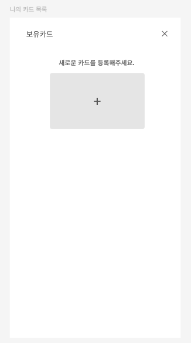
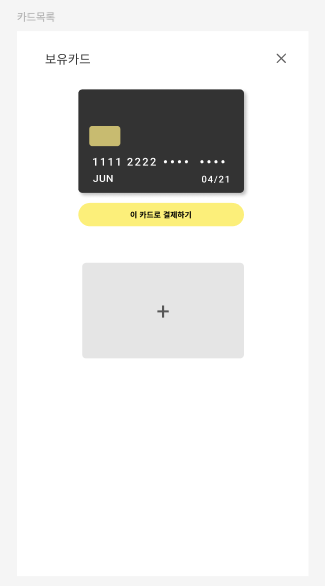
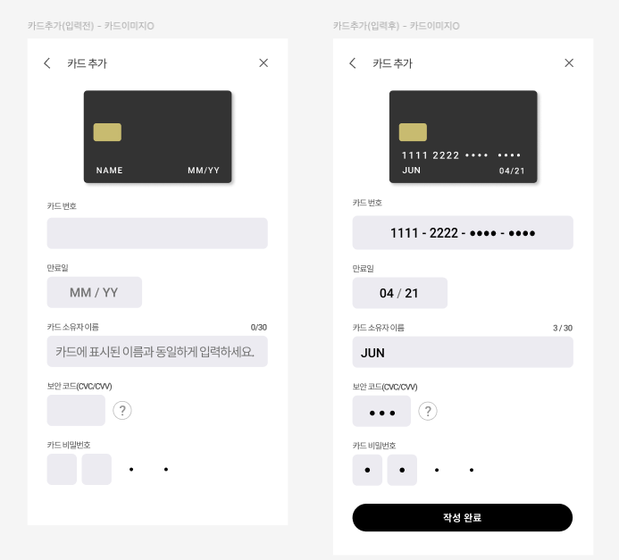

# 결제 모듈 요구사항 분석 및 기능 목록

## 📌 기본 정보
### 프로젝트명: 패션 쇼핑몰 결제 모듈
### 문서 작성자: hyeon

### 사용하게 될 기술: 
- **기본**: React, JavaScript (또는 TypeScript) 
- **상태 관리**: Recoil, Context API / Zustand *(선택)*
- **라우팅**: React Router
- **테스트**: Jest, vitest, Cypress
- **UI 개발 / 문서화**: Storybook
- **배포** : GitHub Pages, Netlify

---

## 📝 고객 요구사항 정리
### 핵심 요구사항
- 상품 카드에 구매 버튼 추가 구현
- 카드 등록 기능 구현
	- 사용자별 복수 카드 등록 기능 구현
- 등록된 카드 목록 조회 및 선택 기능 제공
- 카드 번호 일부 및 CVC 마스킹 처리
- 민감 정보 보안 설계 강화
- 테스트 URL 제공

### 결정 사항
- 구현 기간: 2주
- 주요 구현 범위
	- 상품 카드에 구매 버튼 추가
	- 카드 등록 기능(사용자별 복수 카드 등록)
	- 등록 카드 목록 조회 및 선택 기능
	- 민감 정보 보안 설계 강화
- 결과물
	- 테스트 URL 전달
	- 테스트 후 피드백 전달 예정

---

## 📋 기능 목록 상세 설계
### 1. 라우팅 정책 및 화면 흐름 정의
- `/products` : 상품 목록
- `/payments` : 보유카드(결제수단 목록)
- `/payments/new` : 카드 추가

#### 화면 흐름
- 상품 카드 `구매` 클릭 → `/payments`
- 카드 추가 → `/payments/new`
- 카드 등록 완료 → `/payments` 복귀
- `이 카드로 결제하기` 클릭 → 결제 완료 처리 단계로 진행

### 2. 상품 카드에 구매 기능 추가

#### 기능 설명
- 상품 카드에 구매 버튼을 추가하여 결제 수단 선택 단계로 진입

 

> ※ 제공된 디자인 시안을 기반으로 요구사항에 맞게 구현

#### 세부 작업
- 담기 버튼 옆 구매 버튼 배치
- 클릭 시 `/payments`(보유카드 목록)로 이동
- 구매 대상 상품 정보는 라우트 state 또는 전역 상태로 전달

#### 사용 컴포넌트
- `<ProductCard />`
- `<CheckoutButton />` 
 
### 3. 보유 카드 목록 화면 구성

#### 기능 설명
- 결제 수단 관리 화면(보유카드) 구성
- 상단 공용 헤더, 카드 리스트, 카드 추가 버튼으로 구성

 

> ※ 제공된 디자인 시안을 기반으로 요구사항에 맞게 구현

**카드 목록 - 0개 상태**

**카드 목록 - 1개 이상 상태**

#### 세부 작업
- 모바일 퍼스트 레이아웃 구성
- 공용 헤더 구성: 보유카드 타이틀 + X 닫기
- 카드 리스트 영역 구성
- 카드 추가 버튼은 하단에 배치하여 카드 수와 관계없이 접근 가능하도록 구성

#### 사용 컴포넌트
- `<MyCardsPage />`
- `<PaymentsHeader />` (공용: 보유카드/카드추가 화면에서 재사용)
- `<CardList />`
- `<AddCardCTA />`

### 4. 카드 보유 상태에 따른 화면 분기 처리

#### 기능 설명
- 보유 카드 개수에 따라 화면을 조건부 렌더링
- 사용자에게 현재 상태를 명확히 인지시키는 UI 제공

#### 세부 작업
- 카드 데이터 로딩 상태 관리
- 카드 0개일 경우:
	- 카드 리스트 영역 미노출
	- 카드 추가 버튼 중앙 정렬 배치
- 카드 1개 이상일 경우:
	- 카드 리스트 렌더링
	- 카드 선택 기능 제공
	- 카드 추가 CTA 유지
- (선택) 로딩/에러 상태 분기 처리
	- 로딩 시 Skeleton 또는 Spinner
	- 에러 시 UI 제공

#### 사용 컴포넌트
- `<CardList />`
- `<PayWithThisCardButton />`

### 5. 보유 카드 선택 및 결제 기능 구현

#### 기능 설명
- 카드 선택 상태 관리
- 선택된 카드 기준으로 “이 카드로 결제하기” 버튼을 노출 또는 활성화

#### 세부 작업
- 카드 선택 상태 관리
	- selectedCardId 상태로 선택 카드 식별
	- (선택) 초기값: 카드가 1개 이상이면 첫 번째 카드를 기본 선택
- 선택된 카드 기준으로 하단에 “이 카드로 결제하기” 버튼 표시
- 결제 버튼 활성/비활성 조건 설정
	- 카드가 선택되지 않은 경우 결제 버튼 비활성화
	- 카드가 선택된 경우 결제 버튼 활성화
- 결제 버튼 클릭 시 결제 완료 처리(알림 또는 화면 이동)
	- (선택) 완료 후 /products로 이동 또는 이전 화면으로 복귀
- (선택) 결제 중 로딩 및 중복 클릭 방지
	- 클릭 직후 버튼 disabled 처리 + 로딩 표시
	- 완료 처리 후 disabled 해제

#### 사용 컴포넌트
- `<CardItem />`
- `<PayWithThisCardButton />`
- (선택) `<Toast />` 또는 `alert`

### 6. 카드 등록 화면 구성 및 입력 폼 구현

#### 기능 설명
- 카드 추가 화면 구성
- 카드 미리보기 + 입력 폼 제공
- 모든 입력 필드에 대해 유효성 검증을 수행하고, 조건 충족 시 “작성 완료” 버튼을 활성화

 

> ※ 제공된 디자인 시안을 기반으로 요구사항에 맞게 구현

#### 세부 작업
**1️⃣ 카드 프리뷰 구성**
- 입력값을 useState로 관리하고, onChange를 통해 실시간 업데이트
- `<CardPreview />`에 입력 상태를 props로 전달하여 즉시 반영
- 입력값이 없을 경우 이름 및 만료일은 placeholder 형태로 표시

**2️⃣ 카드번호 입력 처리**
- type="text" + inputMode="numeric" 사용
- onChange에서 숫자만 추출 (replace(/\D/g, ''))
- 최대 16자리 제한
- 4자리 단위 자동 포맷 적용
- 카드번호는 입력창 및 프리뷰 모두 뒤 8자리를 *로 마스킹 처리
- (선택) 붙여넣기 시에도 동일 로직 적용

**3️⃣ 만료일(MM/YY) 입력 처리**
- type="text" + inputMode="numeric" 사용
- 숫자만 입력 허용
- 2자리 입력 시 자동 / 삽입하여 MM/YY 포맷 구성
- 현재 연도 기준 과거 만료일 입력 시 유효하지 않음 처리
- MM 범위 01~12 검증

**4️⃣ 카드 소유자 이름 입력 처리**
- 최대 30자 제한 (maxLength)
- 입력값을 state로 관리하여 실시간 글자수 표시 (현재 글자수 / 30)
- trim() 기준 공백만 입력 시 유효하지 않음 처리
- (선택) 영문 대문자 자동 변환 처리

**5️⃣ CVC 입력 처리**
- type="password" + inputMode="numeric" 사용
- 숫자만 입력 허용
- 최대 3자리 제한
- 화면에는 항상 전체 마스킹 표시
- ? 아이콘 클릭 시 도움말 툴팁 또는 모달 표시
	- 예: “카드 뒷면 서명란 옆 3자리 숫자입니다.”

**6️⃣ 카드 비밀번호 입력 처리**
- 앞 2자리만 입력 받음 (type="password")
	- (선택) 2자리 입력 시 자동 포커스 이동 처리
- 숫자만 허용
- 뒤 2자리는 **로 고정 표시

**7️⃣ 작성 완료 버튼 제어**
- 아래 조건을 모두 만족할 경우 버튼 활성화:
	- 카드번호 16자리
	- 만료일 형식 및 범위 유효
	- 카드 소유자 이름 유효 (공백 제외 1자 이상)
	- CVC 3자리 입력 완료
	- 카드 비밀번호 2자리 입력 완료
- 모든 입력 필드는 숫자/형식 필터링이 선행된 상태를 기준으로 검증
- 버튼은 disabled={!isValid} 방식으로 제어
- 제출 중 중복 클릭 방지
	- 클릭 즉시 버튼 disabled + 처리 완료 후 이동/해제
- 등록 성공 시 `/payments`로 라우팅하여 카드 목록 화면으로 복귀

#### 사용 컴포넌트
- `<AddCardPage />` : 카드 등록 전체 페이지 컨테이너
- `<PaymentsHeader />` : 상단 공용 헤더
- `<CardPreview />` : 입력값 실시간 반영 카드 UI
- `<AddCardForm />` : 입력 필드 그룹 래퍼
- `<CardNumberInput />` : 카드번호 입력
- `<ExpiryInput />` : 만료일 입력
- `<CardOwnerInput />` : 소유자 이름 입력
- `<CvcInput />` : CVC 입력
- `<CardPasswordInput />` : 비밀번호 앞 2자리 입력
- `<SubmitButton />` : 작성 완료 버튼

### 7. 카드 정보 마스킹 및 보안 처리 적용

#### 기능 설명
- 카드 정보 노출 최소화 및 보안 강화 설계 적용

#### 세부 작업
- 카드번호 뒤 8자리 마스킹
- CVC 전체 마스킹
- 비밀번호 일부 고정 마스킹
- 민감정보 전역 상태 저장 금지
- 화면 이탈 시 입력값 폐기
	- 라우팅 이동/닫기 시 로컬 state 초기화
- 로그/에러 객체에 민감값 포함 금지

#### 사용 컴포넌트 / 도구
- `paymentMasking.js`
- `<CardPreview />`
- 상태 관리: Context 기반으로 구현하고, 이후 Recoil 도입