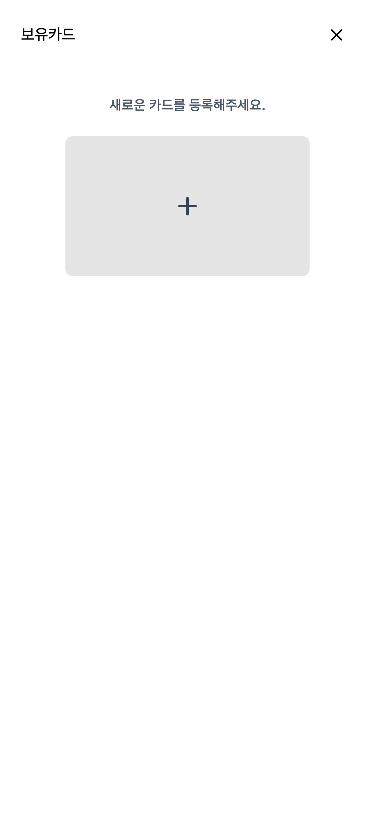
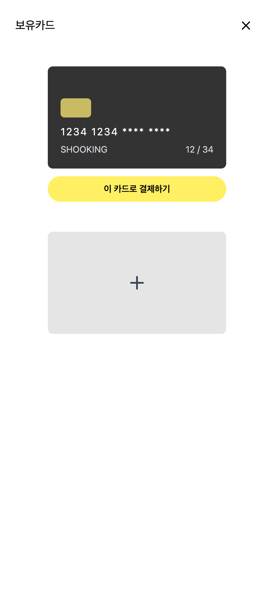
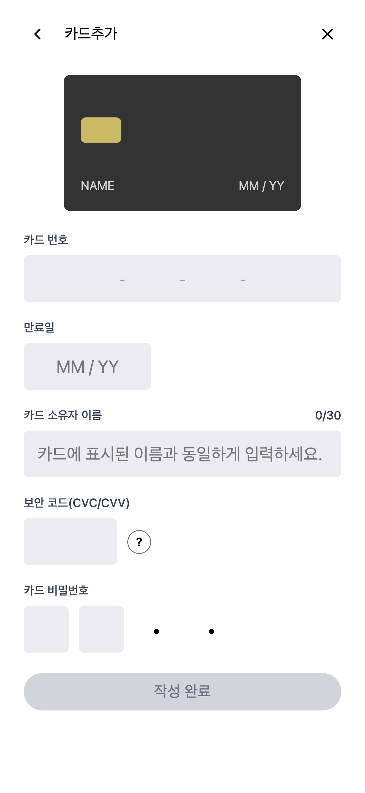
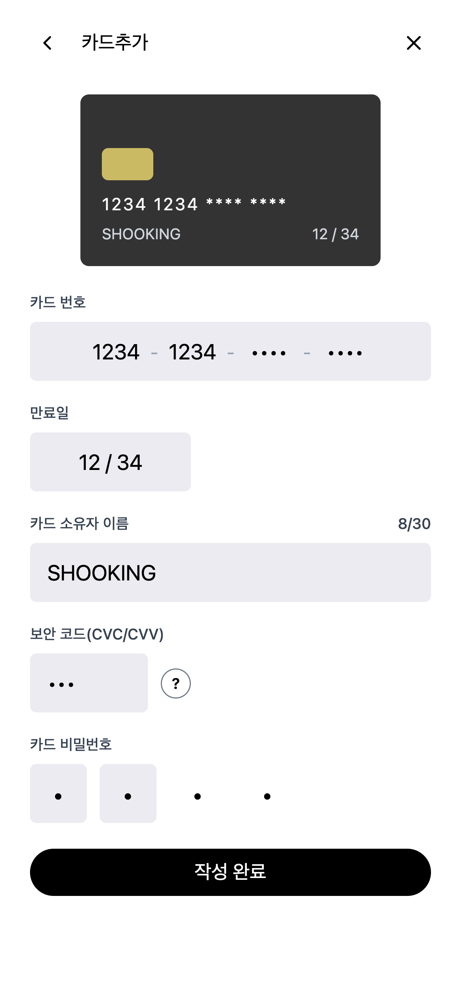

# 결제 모듈 리뷰

본 문서는 상품 목록 페이지 이후 단계인 결제 모듈(보유 카드 목록 및 카드 등록 기능)의 구현 결과를 고객사 요구사항 기준으로 정리한 문서입니다.

### 배포 URL
- 테스트 URL: https://hyeonw8.github.io/shooking/

---

## 고객사 요구사항

고객사에서 전달해주신 이메일 및 피그마 시안을 기반으로 아래와 같이 요구사항을 정리했습니다.

1. 상품 카드에 구매 버튼을 추가하여 결제 단계로 이동할 수 있도록 해주세요.
2. 사용자가 등록한 카드 목록을 확인하고 결제에 사용할 카드를 선택할 수 있도록 해주세요.
3. 카드 등록 기능을 제공하여 사용자가 여러 개의 카드를 추가할 수 있도록 해주세요.
4. 카드 정보 입력 시 카드 번호, CVC 등 민감 정보는 화면에 그대로 노출되지 않도록 마스킹 처리를 적용해 주세요.
5. 카드 등록 화면에서는 카드 입력 정보를 기반으로 카드 미리보기를 제공해 주세요.
6. 카드 등록 시 모든 입력값이 올바르게 입력된 경우에만 등록이 가능하도록 해주세요.
7. 작업 결과를 실제로 확인할 수 있는 테스트 URL을 제공해 주세요.

---

# 요구사항에 따른 기능 동작 확인

## 1) 상품 카드 구매 버튼 및 결제 단계 이동
✔ 상품 카드에서 결제 수단 선택 단계로 이동할 수 있도록 구매 버튼을 추가했습니다.

- 각 상품 카드에 `구매` 버튼을 추가했습니다.
- 버튼 클릭 시 결제 수단 선택 화면(`/payments`)으로 이동합니다.
- 상품 탐색 → 결제 수단 선택 단계로 자연스럽게 이어지도록 사용자 흐름을 구성했습니다.

**확인 방법**

> 상품 카드의 `구매` 버튼을 클릭하면 보유 카드 목록 화면으로 이동하는 것을 확인할 수 있습니다.

---

## 2) 보유 카드 목록 조회 및 카드 선택 화면
✔ 등록된 카드 목록을 확인할 수 있는 결제 수단 선택 화면을 구성했습니다.

- `/payments` 경로에서 보유 카드 목록을 확인할 수 있습니다.
- 등록된 카드가 없는 경우 안내 문구와 카드 추가 버튼이 표시됩니다.
- 카드가 있는 경우 카드 UI 형태로 목록이 표시됩니다.
- 선택된 카드 기준으로 `이 카드로 결제하기` 버튼을 사용할 수 있도록 구성했습니다.

**💳 카드가 없는 경우 화면**

등록된 카드가 없는 경우 안내 메시지와 카드 추가 버튼이 표시됩니다.

**💳 카드가 등록된 이후 화면**

카드 등록 완료 후 보유 카드 목록 화면에서 등록된 카드를 확인할 수 있습니다.

**확인 방법**

> `/payments` 페이지에서 카드 목록이 정상적으로 표시되는지 확인하실 수 있습니다.

---

## 3) 카드 등록 기능
✔ 새로운 결제 카드를 여러 개 등록할 수 있는 화면을 구현했습니다.

- 카드 추가 버튼 클릭 시 `/payments/new` 카드 등록 화면으로 이동합니다.
- 카드 번호, 만료일, 카드 소유자명, CVC, 카드 비밀번호 앞 2자리를 입력할 수 있습니다.
- 모든 입력값이 유효한 경우에만 `작성 완료` 버튼이 활성화됩니다.
- 카드 등록 완료 후 보유 카드 목록 화면(`/payments`)으로 자동 이동합니다.

**💳 카드 등록 전 화면**

카드 정보를 입력하기 전 초기 상태입니다.
입력값이 없는 경우 카드 미리보기에 기본값(`NAME`, `MM / YY`)이 표시됩니다.

**💳 카드 등록 후 화면**

카드 정보를 모두 입력하면 카드 미리보기에 실시간으로 반영되며, `작성 완료` 버튼이 활성화됩니다.

**확인 방법**

> 카드 추가 버튼을 클릭하여 카드 등록 화면으로 이동한 뒤 카드 정보를 입력하면 카드가 등록되고 `/payments` 화면으로 복귀하는 것을 확인할 수 있습니다.

---

## 4) 카드 미리보기 기능
✔ 카드 입력 정보가 카드 UI에 실시간으로 반영되도록 구성했습니다.

- 카드 번호, 카드 소유자 이름, 만료일 입력 시 카드 미리보기 UI에 즉시 반영됩니다.
- 입력값이 없는 경우 기본값(`NAME`, `MM / YY`)이 표시됩니다.
- 카드 번호 뒤 8자리는 `*`로 마스킹 처리된 형태로 표시됩니다.

**확인 방법**

> 카드 등록 화면에서 입력값을 입력하면 상단 카드 UI에 실시간으로 반영되는 것을 확인할 수 있습니다.

---

## 5) 카드 정보 마스킹 및 보안 처리
✔ 카드 정보 노출을 최소화하도록 마스킹 처리를 적용했습니다.

- 카드 번호 뒤 8자리는 `*`로 마스킹 처리됩니다.
- CVC 입력값은 `password` 타입으로 마스킹 처리됩니다.
- 카드 비밀번호는 앞 2자리만 입력받고 나머지는 고정 마스킹 UI로 표시됩니다.
- 민감 정보(CVC, 카드 비밀번호)는 전역 상태에 저장되지 않도록 구조를 설계했습니다.

**확인 방법**

> 카드 번호와 CVC 입력 시 화면에 실제 숫자가 그대로 노출되지 않는 것을 확인하실 수 있습니다.

---

## 6) 카드 등록 유효성 검증
✔ 카드 등록 시 입력값 유효성 검증을 적용했습니다.

- 카드 번호는 숫자 16자리 입력을 기준으로 검증합니다.
- 만료일은 `MMYY` 형식과 월 범위(01~12), 과거 날짜 여부를 확인합니다.
- 카드 소유자 이름은 공백만 입력되는 경우 등록이 불가능합니다.
- CVC는 숫자 3자리 입력을 기준으로 검증합니다.
- 카드 비밀번호는 앞 2자리 입력이 필요합니다.

모든 조건을 만족해야 `작성 완료` 버튼이 활성화됩니다.

**확인 방법**

> 입력값이 부족하거나 형식이 맞지 않을 경우 등록 버튼이 활성화되지 않는 것을 확인하실 수 있습니다.

---

## 7) 배포 URL
✔ 요청하신 대로 테스트 URL을 제공했습니다.

- 별도 설치 없이 웹 브라우저에서 바로 확인 가능합니다.
- 아래 링크 접속 후, 모든 기능의 실제 동작을 확인하실 수 있습니다.
- 배포 URL: https://hyeonw8.github.io/shooking/

---

# 참고 및 향후 개선 사항

- 현재 상품 데이터와 카드 데이터는 **테스트용 mock 데이터**로 구성되어 있습니다.
- 카드 목록 및 장바구니 상태는 **브라우저 새로고침 시 초기화됩니다.**
- 카드 목록은 현재 **단일 카드 렌더링 구조로 구현되어 있으며**, 향후 다중 카드 렌더링(`cards.map`) 및 카드 선택 UI와 함께 확장 예정입니다.
- 현재 결제 버튼은 테스트용 인터랙션으로 동작하며 실제 결제 처리 기능은 추후 연동 예정입니다.

> 본 문서는 고객사 요구사항을 기준으로 구현된 기능 동작을 정리한 문서이며, 추가 요청 사항이 있을 경우 반영하여 업데이트할 예정입니다.