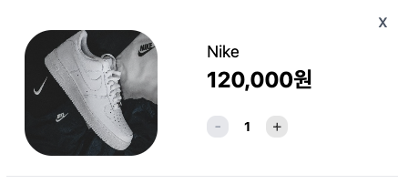
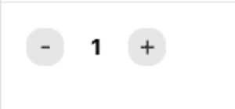
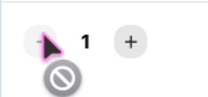
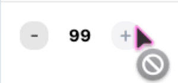

# 🛒 shooking - 장바구니 페이지

작성자: hyeon (개인 프로젝트)

#### 배포 URL

- 테스트 URL: https://hyeonw8.github.io/shooking/

## 프로젝트 개요

shooking은 20~30대 젊은 세대를 타깃으로 한 패션 브랜드로,
주력 상품은 신발입니다.

본 장바구니 페이지는 사용자가 담은 상품을 확인하고, 수량을 조절하며 총 금액을 확인한 뒤 결제 단계로 이동할 수 있도록 구현한 기능입니다.  
장바구니 페이지 구현 이후 상품 탐색부터 결제까지 자연스럽게 이어지는 사용자 흐름을 구성하는 것을 목표로 합니다.

---

### 주요 기능

- **장바구니 상품 목록 조회**
  - 장바구니에 담은 상품을 리스트 형태로 확인
  - 상품 이미지, 브랜드명, 가격, 수량 정보 표시

- **상품 수량 변경**
  - `+` / `-` 버튼을 통해 수량 변경
  - 수량 변경 시 금액 자동 재계산
  - 최소 1, 최대 99개로 수량 제한

- **상품 삭제**
  - 개별 상품 삭제 가능
  - 삭제 시 장바구니 상태 및 금액 즉시 반영

- **금액 계산 및 배송비 정책 적용**
  - 상품 금액, 배송비, 총 금액 자동 계산
  - 배송비 정책 적용
    - 10만 원 이상 구매 시 무료배송

## 프로젝트 구조 요약

- **Recoil 기반 상태 관리**
  - 장바구니 상태를 전역에서 관리
  - `cartItemsState`를 원본 상태(atom)로 관리
  - `cartSubtotalState`, `cartShippingFeeState`, `cartTotalState`를 selector로 분리하여 파생 상태 구성
  - 컴포넌트에서는 파생 상태만 구독하여 불필요한 계산 및 리렌더링 최소화

- **UI / Hook / Utils / State 레이어로 역할을 분리하여 유지보수성을 고려한 구조 설계**
  - UI 컴포넌트는 렌더링에 집중
  - 수량 변경, 상품 삭제 등 액션 로직은 `useCartActions` 훅으로 분리
  - 금액 계산 및 상태 변경 로직은 utils로 분리하여 관심사 분리

- **순수 함수 기반 장바구니 로직 설계**
  - 로직을 순수 함수로 구성하여 테스트 가능하도록 설계
  - 수량은 `Math.min / Math.max`를 활용하여 1~99 범위로 제한

- **상태 기반 UI 분기 처리**
  - `isCartEmptyState`를 통해 장바구니 상태 분기
  - 빈 상태에서는 `EmptyCart` UI를 우선 노출
  - 상품 존재 시 목록 + 주문 요약 영역 렌더링

- **컴포넌트 재사용을 고려한 구조**
  - 금액 표시 UI를 `AmountRow`로 통합
  - 배송비는 툴팁 포함 별도 컴포넌트(`ShippingFee`)로 분리
  - 수량 조절 UI는 `QuantityControl`로 분리하여 재사용성 확보

- **Storybook + Vitest 기반 UI/로직 검증**
  - Storybook: UI 상태 및 상호작용 확인
  - Vitest: 장바구니 로직 및 컴포넌트 동작 단위 테스트

---

## 개발 환경

**Runtime**

- Node.js v20+

**Frontend**

- React 18 (Vite 기반) + React Router v7
- JavaScript (ES6+)
- Tailwind CSS

**State Management**

- Recoil

**Testing**

- Vitest
- jsdom
- React Testing Library
  - @testing-library/react
  - @testing-library/user-event
  - @testing-library/dom
  - @testing-library/jest-dom
- Storybook

**Deployment**

- GitHub Actions

**Environment Variables**

- 본 프로젝트는 현재 `.env` 파일 및 환경변수를 사용하지 않음

---

## 설치 및 실행 방법

1. 패키지 설치 (노드 버전 20 이상 권장)

```
yarn install
```

2. 개발 서버 실행

```
yarn dev
```

3. 프로덕션 빌드

```
yarn build
```

4. 빌드 결과 미리보기

```
yarn preview
```

## 컴포넌트 구조

### **페이지/레이아웃 흐름**

```
CartPage (/cart)
 ├── Header (variant="cart")
 ├── (empty)
 │    └── EmptyCart
 └── (default)
      ├── PageHeaderInfo
      ├── CartList
      │    └── CartItem
      │         └── QuantityControl
      └── OrderSummary
           ├── AmountRow
           ├── ShippingFee
           └── CheckoutButton
```

### **상태 관리 구조 및 흐름**

- cartItemsState를 기준으로 selector를 통해 파생 상태를 계산하는 구조

```
cartItemsState (atom)
 ├── cartCountState
 ├── isCartEmptyState
 ├── cartSubtotalState
 ├── cartShippingFeeState
 └── cartTotalState
```

### 라우팅 구조

| 경로        | 설명           |
| ----------- | -------------- |
| `/`         | 상품 목록      |
| `/cart`     | 장바구니 목록  |
| `/payments` | 보유 카드 목록 |

> 상품 탐색 → 장바구니 → 결제 수단 선택 흐름으로 라우팅을 구성했습니다.

### **주요 컴포넌트 설명**

#### 1️⃣ 상태 관리 레이어 (state)

`cartItemsState`

장바구니 상품 목록을 관리하는 atom

| 역할      | 설명                                                      |
| --------- | --------------------------------------------------------- |
| 원본 상태 | 장바구니 상품 배열 (id, image, brand, price, quantity 등) |

---

`cartCountState`

장바구니에 담긴 상품 개수를 계산하는 selector

- `cartItemsState`를 기반으로 현재 담긴 상품 수를 반환
- `PageHeaderInfo`의 상품 개수 표시 등에 사용

---

`isCartEmptyState`

장바구니 비어있는 상태 판단 selector

- UI 분기 처리에 사용, 비어있는 상태면 `EmptyCart` 렌더링

---

`cartSubtotalState` / `cartShippingFeeState` / `cartTotalState`

장바구니 금액 관련 파생 상태(selector)

| selector             | 역할           |
| -------------------- | -------------- |
| cartSubtotalState    | 상품 금액 계산 |
| cartShippingFeeState | 배송비 계산    |
| cartTotalState       | 총 금액 계산   |

- selector를 통해 상태 변경 시 자동 재계산
- 컴포넌트에서는 계산 로직 없이 값만 구독
- `cartSubtotalState` → `cartShippingFeeState` → `cartTotalState` 순으로 파생 상태가 연결되는 구조

---

---

#### 2️⃣ 액션 및 로직 레이어 (hooks / utils)

`useCartActions`

장바구니 상태 변경 액션을 제공하는 커스텀 훅

| 함수               | 역할                          |
| ------------------ | ----------------------------- |
| `handleAddItem`    | 상품을 장바구니에 추가        |
| `handleRemoveItem` | 특정 상품을 장바구니에서 제거 |
| `handleToggleItem` | 장바구니 담기/해제 토글       |
| `handleIncrease`   | 특정 상품 수량 증가           |
| `handleDecrease`   | 특정 상품 수량 감소           |

- `useSetRecoilState(cartItemsState)`를 사용해 장바구니 원본 상태를 갱신
- 컴포넌트에서는 상태 변경 구현을 직접 다루지 않고, 액션 함수만 호출하도록 분리
- 상태 변경 로직은 utils에 위임하여 관심사를 분리한 구조

---

`cartUtils`

장바구니 관련 순수 함수 모음

| 함수                   | 역할                                  |
| ---------------------- | ------------------------------------- |
| `addCartItem`          | 새 상품 추가 또는 기존 상품 수량 증가 |
| `removeCartItem`       | 특정 상품 제거                        |
| `toggleCartItem`       | 상품 존재 여부에 따라 추가/제거 토글  |
| `increaseQuantity`     | 특정 상품 수량 증가 (최대 99 제한)    |
| `decreaseQuantity`     | 특정 상품 수량 감소 (최소 1 제한)     |
| `calculateSubtotal`    | 상품 금액 합계 계산                   |
| `calculateShippingFee` | 배송비 계산                           |
| `calculateTotal`       | 총 금액 계산                          |

- 모든 로직을 순수 함수로 분리하여 테스트 가능한 구조로 설계
- `addCartItem`은 동일 상품이 이미 존재하면 새로 추가하지 않고 수량을 증가시키는 방식
- 상품이 처음 담길 경우 `quantity` 기본값은 `1`로 처리
- 수량 증감은 `Math.min`, `Math.max`를 활용하여 1~99 범위를 벗어나지 않도록 제한
- 배송비는 상품 금액이 `0원`이거나 `10만 원 이상`일 경우 무료배송(배송비 0원), 그 외에는 3000원으로 계산

---

---

#### 3️⃣ 장바구니 페이지 및 주요 UI 컴포넌트

`CartPage`

장바구니 페이지 전체 레이아웃을 구성하는 페이지 컴포넌트

| 역할          | 설명                                |
| ------------- | ----------------------------------- |
| 상태 조회     | 장바구니 상태 및 상품 개수 조회     |
| 조건부 렌더링 | empty / default UI 분기             |
| 레이아웃 구성 | Header, CartList, OrderSummary 배치 |

- 장바구니가 비어 있으면 `EmptyCart`를 우선 렌더링
- 상품이 존재하면 `PageHeaderInfo`, `CartList`, `OrderSummary`를 렌더링
- `isCartEmptyState`, `cartCountState`를 구독하여 페이지 전체 UI를 제어

---

`Header`

공용 상단 헤더 UI 컴포넌트  
장바구니 페이지에서는 `variant="cart"`를 전달하여 뒤로가기 중심의 헤더로 사용

| Props     | 설명                              |
| --------- | --------------------------------- |
| `variant` | 페이지 유형에 따라 헤더 UI를 구분 |
| `title`   | 헤더 중앙에 표시할 제목           |

- 장바구니 페이지에서는 `variant="cart"`를 사용
  - 해당 variant에서는 제목 대신 뒤로가기 버튼만 표시
  - 뒤로가기 버튼 클릭 시 이전 페이지(상품 목록)로 이동
- 공용 컴포넌트를 재사용하면서 페이지별 헤더 역할을 분기하는 구조

---

`PageHeaderInfo`

페이지 제목과 현재 담긴 상품 개수를 표시하는 공용 정보 영역 컴포넌트

| Props         | 설명           |
| ------------- | -------------- |
| `title`       | 페이지 제목    |
| `description` | 보조 설명 문구 |

- 장바구니 상품이 존재할 때만 렌더링
- `cartCountState` 기반으로 현재 담긴 상품 개수를 안내

---

`CartList`

장바구니 상품 목록을 렌더링하는 컴포넌트

- `cartItemsState`를 구독하여 상품 배열을 조회
- 각 상품을 `CartItem`으로 렌더링
- 상품이 없을 경우 렌더링하지 않으며, 상위 컴포넌트에서 EmptyCart로 분기 처리

---

`CartItem`

장바구니 단일 상품 카드 컴포넌트

| 기능           | 설명                               |
| -------------- | ---------------------------------- |
| 상품 정보 표시 | 이미지, 브랜드명, 가격 표시        |
| 수량 변경      | `QuantityControl`을 통해 수량 조절 |
| 상품 삭제      | 삭제 버튼 클릭 시 해당 상품 제거   |

- `useCartActions`를 통해 수량 증가/감소 및 삭제 액션 연결
- 수량 값에 따라 최소/최대 제한 상태를 `QuantityControl`에 전달

---

`QuantityControl`

상품 수량 증가/감소 UI 컴포넌트

| Props             | 설명                    |
| ----------------- | ----------------------- |
| `quantity`        | 현재 수량               |
| `onIncrease`      | 수량 증가 핸들러        |
| `onDecrease`      | 수량 감소 핸들러        |
| `disableIncrease` | 증가 버튼 비활성화 여부 |
| `disableDecrease` | 감소 버튼 비활성화 여부 |

- `+ / -` 버튼을 통해 수량 조절
- 최소 1, 최대 99 조건에 따라 버튼 disabled 처리

---

`OrderSummary`

장바구니 금액 요약 영역 컴포넌트

| 역할           | 설명                                     |
| -------------- | ---------------------------------------- |
| 금액 조회      | 상품 금액, 배송비, 총 금액 selector 구독 |
| 요약 표시      | 상품 금액 / 배송비 / 총 금액 렌더링      |
| 결제 액션 처리 | `CheckoutButton`에 결제 이동 핸들러 전달 |

- `CheckoutButton`은 상품 금액이 0원일 경우 비활성화 처리
- 결제 버튼 클릭 시 `/payments`로 이동하는 로직은 `OrderSummary`에서 담당

---

`AmountRow`

금액 표시용 공통 UI 컴포넌트

| Props   | 설명    |
| ------- | ------- |
| `label` | 항목명  |
| `value` | 금액 값 |

- 상품 금액, 총 금액 표시를 공통 구조로 렌더링

---

`ShippingFee`

배송비 표시 및 정책 안내용 컴포넌트

| Props | 설명        |
| ----- | ----------- |
| `fee` | 배송비 금액 |

- 배송비 금액 표시
- 버튼 클릭 시 배송비 정책 툴팁 노출
  - 10만 원 이상 무료, 그 외 3000원
- 접근성을 고려하여 aria 속성 적용

---

`CheckoutButton`

결제 액션 버튼 UI 컴포넌트

| Props      | 설명               |
| ---------- | ------------------ |
| `disabled` | 버튼 비활성화 여부 |
| `onClick`  | 버튼 클릭 핸들러   |

- 결제 단계로 이동하는 CTA 버튼 UI를 담당
  - 버튼 클릭 시 결제 수단 선택 페이지(`/payments`)로 이동
- 실제 이동 로직은 상위 컴포넌트에서 전달한 `onClick`으로 처리
- 장바구니가 비어 있는 경우 비활성화

---

`EmptyCart`

장바구니가 비어 있을 때 표시하는 빈 상태 UI 컴포넌트

- 안내 메시지 표시
- 상품 탐색으로 돌아갈 수 있도록 `/` 경로 이동 CTA 버튼 제공

---

## 테스트 방법

### 테스트 실행

#### 1) Vitest 단위 테스트 실행 (1회 실행)

```bash
yarn test        # watch 모드
yarn test:run    # 1회 실행
```

#### 2) Storybook 실행

```bash
yarn storybook
```

> 장바구니 페이지에서는 Vitest로 장바구니 로직 및 컴포넌트 동작을 검증하고,
> Storybook으로 UI 상태와 상호작용을 확인하는 방식으로 테스트를 구성했습니다.
> 로직 테스트와 UI 상태 테스트의 책임을 분리하는 구조로 설계했습니다.

### Storybook UI 확인

장바구니 UI는 Storybook을 실행하여 다양한 상태를 확인할 수 있습니다.

#### 1. CartItem




> 상품 이미지, 브랜드명, 가격, 수량 UI 확인

#### 2. QuantityControl





> 기본 수량 상태  
> 최소 수량(1)에서 감소 버튼 비활성화 상태  
> 최대 수량(99)에서 증가 버튼 비활성화 상태

#### 3. ShippingFee


> 배송비 표시 및 안내 버튼 클릭 시 툴팁 노출 확인

#### 4. EmptyCart


> 장바구니가 비어있는 상태 UI 및 CTA 버튼 확인


## 테스트 범위

### 1. 장바구니 유틸 함수 테스트 (`cartUtils.test.js`)

- 상품 추가, 제거, 토글 동작 검증
  - `addCartItem`: 새 상품 추가 및 기존 상품 수량 증가 처리
  - `removeCartItem`: 특정 id 상품 제거
  - `toggleCartItem`: 상품 존재 여부에 따른 추가/제거 토글

- 수량 증가/감소 동작 검증
  - `increaseQuantity`: 수량 증가 처리
  - `decreaseQuantity`: 수량 감소 처리

- 수량 제한 검증
  - 수량은 최소 1, 최대 99 범위를 유지하는지 확인

- 불변성 검증
  - 상태 변경 시 원본 배열을 직접 변경하지 않는지 확인

- 금액 계산 검증
  - `calculateSubtotal`: 상품 금액 합계 계산
  - `calculateShippingFee`: 배송비 계산 (무료배송(0원) / 일반 배송(3000원))
  - `calculateTotal`: 총 금액 계산

### 2. Recoil 상태 및 selector 테스트 (`cartState.test.jsx`)

- 기본 상태 검증
  - 초기 상태에서 장바구니가 비어있는지 확인

- 파생 상태 계산 검증
  - `cartCountState`: 장바구니 상품 개수 계산
  - `isCartEmptyState`: 장바구니 비어있는 상태 판단
  - `cartSubtotalState`: 상품 금액 합계 계산
  - `cartShippingFeeState`: 배송비 계산
  - `cartTotalState`: 총 금액 계산

- 조건별 금액 계산 검증
  - 무료배송 기준 이상일 때 배송비 0원 처리
  - 무료배송 기준 미만일 때 배송비 3000원 처리

### 3. CheckoutButton 컴포넌트 테스트 (`CheckoutButton.test.jsx`)

- 버튼 렌더링 검증
  - "결제하기" 버튼이 정상적으로 렌더링되는지 확인

- 상태 검증
  - 기본적으로 버튼이 활성화 상태인지 확인
  - `disabled` 값에 따른 활성/비활성 상태 확인

- 상호작용 검증
  - 활성 상태에서 클릭 시 `onClick`이 호출되는지 확인
  - 비활성 상태에서 클릭 시 `onClick`이 호출되지 않는지 확인

### 4. QuantityControl 컴포넌트 테스트 (`QuantityControl.test.jsx`)

- UI 렌더링 검증
  - 수량 증가/감소 버튼 및 현재 수량 표시 확인

- 상호작용 검증
  - 증가 버튼 클릭 시 `onIncrease` 호출 여부 확인
  - 감소 버튼 클릭 시 `onDecrease` 호출 여부 확인

- 상태 기반 UI 검증
  - 수량이 1일 때 감소 버튼 비활성화 확인
  - 수량이 99일 때 증가 버튼 비활성화 확인

### 5. ShippingFee 컴포넌트 테스트 (`ShippingFee.test.jsx`)

- UI 렌더링 검증
  - 배송비 금액이 정상적으로 표시되는지 확인
  - 배송비 안내 버튼 렌더링 확인

- 상호작용 검증
  - 버튼 클릭 시 배송비 정책 툴팁 노출 여부 확인
  - 버튼 재클릭 시 툴팁이 닫히는지 확인

### 6. EmptyCart 컴포넌트 테스트 (`EmptyCart.test.jsx`)

- UI 렌더링 검증
  - 빈 상태 안내 문구 및 CTA 버튼 렌더링 확인

- 라우팅 동작 검증
  - "상품 보러가기" 버튼 클릭 시 `/` 경로로 이동하는지 확인

### 7. CartItem 컴포넌트 테스트 (`CartItem.test.jsx`)

- UI 렌더링 검증
  - 상품 이미지, 브랜드명, 가격 표시 확인

- 구성 요소 검증
  - `QuantityControl` 컴포넌트가 정상적으로 렌더링되는지 확인

---

## Storybook 스토리 구성

### 1. CartItem 상태별 UI (`CartItem.stories.jsx`)

- `Default` : 기본 상품 카드 상태
- `LongBrandName` : 긴 브랜드명 표시 상태
- `HighPrice` : 높은 가격 표시 상태
- `HighQuantity` : 높은 수량 표시 상태
- `Minimum` : 최소 수량(1) 상태
- `Maximum` : 최대 수량(99) 상태

### 2. CheckoutButton 상태별 UI (`CheckoutButton.stories.jsx`)

- `Enabled` : 버튼 활성 상태
- `Disabled` : 버튼 비활성 상태

### 3. EmptyCart 빈 상태 UI (`EmptyCart.stories.jsx`)

- `Default` : 장바구니가 비어 있는 상태 UI

### 4. QuantityControl 상태별 UI (`QuantityControl.stories.jsx`)

- `Default` : 기본 수량 상태
- `HighQuantity` : 높은 수량 상태
- `Minimum` : 최소 수량 상태 (감소 버튼 비활성화)
- `Maximum` : 최대 수량 상태 (증가 버튼 비활성화)

### 5. ShippingFee 상호작용 UI (`ShippingFee.stories.jsx`)

- `Default` : 기본 배송비 상태 (3000원)
- `Free` : 무료배송 상태 (0원)
- `TooltipOpen` : 배송비 안내 버튼 클릭 시 툴팁 노출 상태

---

## 유의사항 및 알려진 이슈

- 현재 상품 데이터는 **mock 데이터 기반**으로 구성되어 있습니다.
- 장바구니 및 카드 목록 상태는 브라우저를 새로고침할 경우 초기화됩니다. (추후 로컬 스토리지 또는 서버 연동으로 개선 가능)
- React 19와 Recoil 최신 버전 간 호환성 이슈가 있어, 안정적인 동작을 위해 React 18로 다운그레이드할 예정입니다.

---

## 향후 개발 예정

- 전체 쇼핑몰 기능 통합 및 상세페이지 구현

## 참고 자료

- Recoil 공식 문서
- React Testing Library 문서
- Storybook Docs
