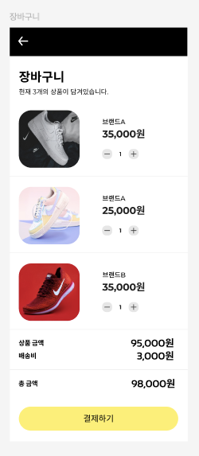

# 장바구니 페이지 요구사항 분석 및 기능 목록

## 📌 기본 정보

### 프로젝트명: 패션 쇼핑몰 장바구니 페이지

### 문서 작성자: hyeon

### 사용하게 될 기술:

- **기본**: React, JavaScript
- **상태 관리**: Recoil (기존 Context API + useReducer 기반 구조에서 확장 및 전환 예정)
- **라우팅**: React Router
- **테스트**: Vitest, Cypress
- **UI 개발 / 문서화**: Storybook
- **배포**: GitHub Pages, GitHub Actions

---

## 📝 고객 요구사항 정리

### 핵심 요구사항

- 장바구니 페이지 신규 도입
- 여러 상품을 한 화면에서 확인하고 비교할 수 있는 상품 목록 제공
- 장바구니 상품 가격 및 수량 표시
- 상품 수량 기반 총 금액 계산
- 배송비 정보 표시
  - **10만 원 이상 구매 시 배송비 무료 정책 적용**
- 테스트 URL 제공 후 고객사 테스트 및 피드백 진행

---

### 결정 사항

- 구현 기간: 2주
- 주요 구현 범위
  - 장바구니 페이지 구현
  - 상품 목록 제공
  - 상품 가격 표시 및 수량 기반 총 금액 계산
  - 배송비 정책 적용
- 결과물
  - 테스트 URL 전달
  - 테스트 후 피드백 전달 예정

---

## 📋 기능 목록 상세 설계

### 1. 라우팅 정책 및 화면 흐름 정의

#### 라우팅 정책

- `/` : 상품 목록
- `/cart` : 장바구니 페이지
- `/payments` : 결제 수단 선택

#### 화면 흐름

- 상품 카드 `담기` 클릭 → 장바구니 상태에 상품 추가
- 헤더 장바구니 아이콘 클릭 → `/cart`
- 장바구니 페이지에서 `결제하기` 버튼 클릭 → `/payments`

---

### 2. 장바구니 페이지 레이아웃 구성

#### 기능 설명

- 사용자가 장바구니에 담은 상품을 한 화면에서 확인할 수 있는 페이지 구성
- 상단 헤더, 페이지 제목/상품 개수 안내, 상품 목록 영역, 주문 요약 영역으로 구성

> ※ 제공된 디자인 시안을 기반으로 요구사항을 정리했습니다.

#### 세부 작업

- 모바일 퍼스트 레이아웃 구성
- 기존 상품 목록 페이지에서 사용하던 공용 `Header` 컴포넌트를 재사용
  - `variant="cart"` 옵션을 추가하여 뒤로가기 중심의 장바구니 전용 헤더 구성
- 페이지 제목과 현재 담긴 상품 개수를 표시하는 `PageHeaderInfo` 영역 구성
- 장바구니가 비어 있는 경우 페이지 제목/개수 안내 대신 빈 상태 메시지 UI를 우선 노출
- 장바구니 상품 목록 영역 구성
- 주문 요약 영역 구성
- 하단 결제 버튼 배치

#### 사용 컴포넌트

- `<CartPage />`
- `<Header />` (`variant="cart"`)
- `<PageHeaderInfo />`
- `<CartList />`
- `<CartItem />`
- `<OrderSummary />`
- `<CheckoutButton />`

---

### 3. 장바구니 상품 목록 표시

#### 기능 설명

- 사용자가 장바구니에 담은 상품 목록을 표시
- 각 상품은 이미지, 브랜드명, 가격, 수량 변경 UI를 포함한 카드 형태로 구성

#### 세부 작업

- 장바구니에 담긴 상품 리스트 렌더링
- 각 상품 카드에 다음 정보 표시
  - 상품 이미지
  - 브랜드명
  - 가격
  - 수량
- 상품이 여러 개일 경우 스크롤로 확인 가능

**장바구니 상태 분기**

- 상품이 없는 경우
  - 장바구니 비어있음 안내 메시지 표시
  - 사용자가 상품 탐색으로 돌아갈 수 있도록 상품 목록 페이지 이동 CTA 버튼 제공

- 상품이 있는 경우
  - 장바구니 상품 목록 표시
  - 주문 요약 영역 표시

#### 사용 컴포넌트

- `<CartList />`
- `<CartItem />`
- `<EmptyCart />`

---

### 4. 장바구니 상품 수량 변경 기능

#### 기능 설명

- 사용자가 장바구니 내 상품 수량을 직접 변경할 수 있는 기능 제공

#### 세부 작업

- 각 상품 카드에 수량 증가/감소 버튼 배치
- `-` 버튼 클릭 시 수량 감소
- `+` 버튼 클릭 시 수량 증가
- 수량 변경 시 상품 금액 및 총 금액 즉시 재계산
- (선택) 수량이 **1인 경우 `-` 버튼 비활성화**
- (선택) 상품 삭제를 위한 `X` 버튼 제공
- (선택) `X` 버튼 클릭 시 해당 상품 장바구니에서 제거

#### 사용 컴포넌트

- `<QuantityControl />` 
- `<CartItem />`

---

### 5. 장바구니 상품 수량 및 금액 계산

#### 기능 설명

- 상품 수량과 가격을 기반으로 상품 금액 계산

#### 세부 작업

- 각 상품 가격 × 수량으로 상품별 금액 계산
- 전체 상품 금액 합산하여 상품 금액 산출
- 상품 금액 기준으로 배송비 정책 적용 여부 판단

**사용 상태 관리**

- `cartItemsState`
  - 구조: 상품 id, 브랜드명, 가격, 수량, 이미지 정보를 포함하는 객체 배열 형태로 관리
- 상태 관리 방식  
  기존 **Context API + useReducer 기반 장바구니 상태 구조에서 Recoil 기반 전역 상태 관리로 확장 및 전환 예정**

**Recoil 상태 구조**

- `cartItemsState` : 장바구니 상품 목록 (원본 상태, atom)
- `cartSubtotalState` : 상품 금액 (파생 상태, selector)
- `cartShippingFeeState` : 배송비 (파생 상태, selector)
- `cartTotalState` : 총 금액 (파생 상태, selector)

#### 사용 컴포넌트

- `<OrderSummary />`

#### 관련 상태 / 파일

- `cartState.js`

---

### 6. 배송비 정책 적용

#### 기능 설명

- 배송비 정책을 장바구니 금액 계산에 반영
- 10만 원 이상 구매 시 배송비 무료

#### 세부 작업

- 상품 금액 기준으로 배송비 계산
  - 10만 원 이상: 배송비 무료
  - 10만 원 미만: 배송비 부과
- 배송비 표시
  - 배송비 정책 안내를 위해 배송비 항목 옆에 **정보 아이콘(`i`) 제공**
  - 정보 아이콘 클릭 시 배송비 정책 안내 표시
    - 예: `10만 원 이상 구매 시 배송비 무료`

#### 사용 컴포넌트

- `<ShippingFee />`
- `<ShippingPolicyTooltip />` (선택)

#### 관련 상태 / 파일

- `cartShippingFeeState`
- `cartState.js`

---

### 7. 총 금액 표시

#### 기능 설명

- 상품 금액과 배송비를 포함한 총 금액 표시
- 금액 요약 영역은 `OrderSummary` 컴포넌트에서 관리
- 내부 항목은 각각 별도 컴포넌트로 구성

#### 세부 작업

- 상품 금액 표시
- 배송비 표시
- 총 금액 표시
- 상품 금액과 배송비를 합산하여 총 금액 산출

#### 사용 컴포넌트

- `<OrderSummary />`
- `<AmountRow />`
- `<ShippingFee />`

---

### 8. 결제 단계 이동 기능

#### 기능 설명

- 장바구니에서 결제 단계로 이동하는 기능 제공

#### 세부 작업

- 장바구니 하단에 `결제하기` 버튼 배치
- 클릭 시 `/payments` 이동
- 장바구니 상품이 없는 경우 결제 버튼 비활성화

**전달 데이터**

- 주문 상품 목록
  - 브랜드명
  - 상품 단가
  - 상품 수량
  - 상품별 금액
- 상품 금액
- 배송비
- 총 금액

**전달 방식**

- 서버 저장소가 없는 현재 구조에서는 **Recoil 기반 전역 상태로 주문 정보 관리**
- 결제 페이지에서 해당 전역 상태를 참조하여 주문 상품 및 금액 정보 구성
- 추후 서버 API 또는 BaaS 연동 시 주문 데이터 저장/조회 방식으로 확장 가능

#### 사용 컴포넌트

- `<CheckoutButton />`

---

## 📌 향후 확장 고려 사항(선택 사항)

- 장바구니 상품 삭제 기능
- 로딩 및 에러 상태 처리
- 결제 페이지와 데이터 연동 상세화
- 장바구니 비어있는 상태 UI 개선