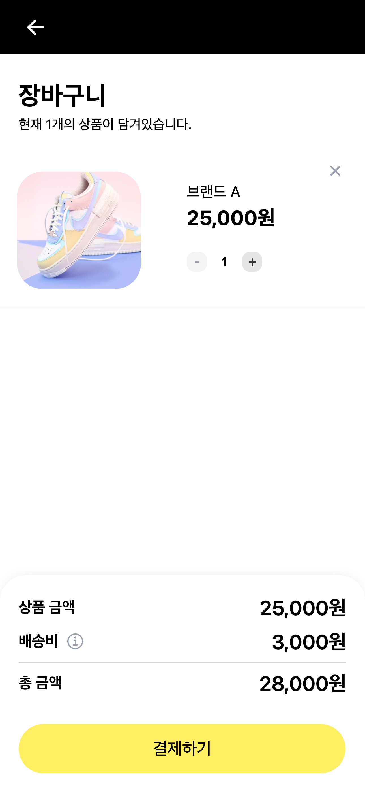
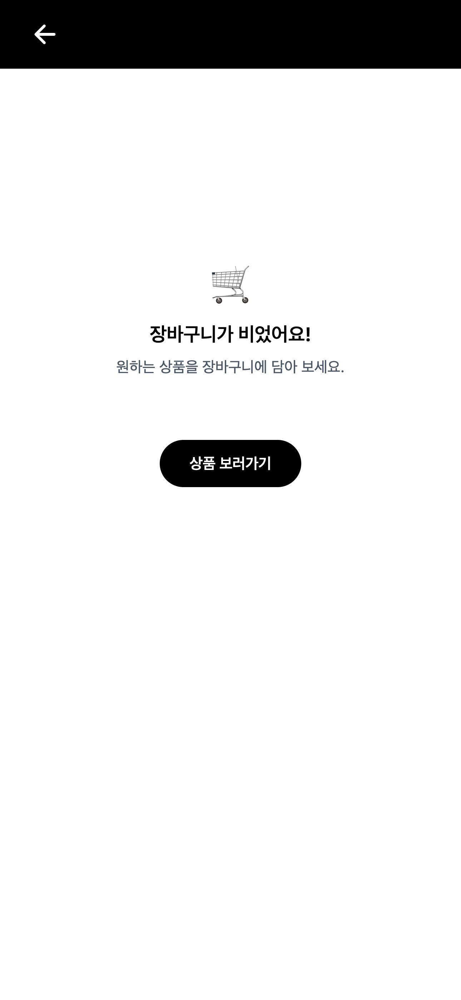
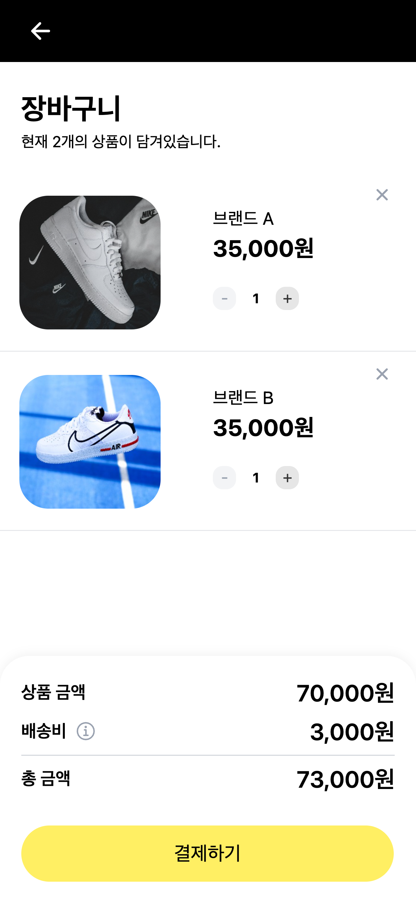
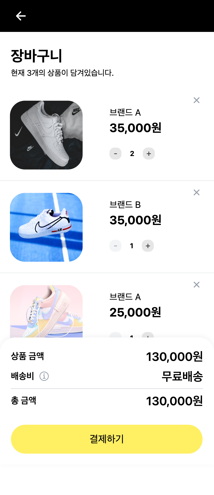
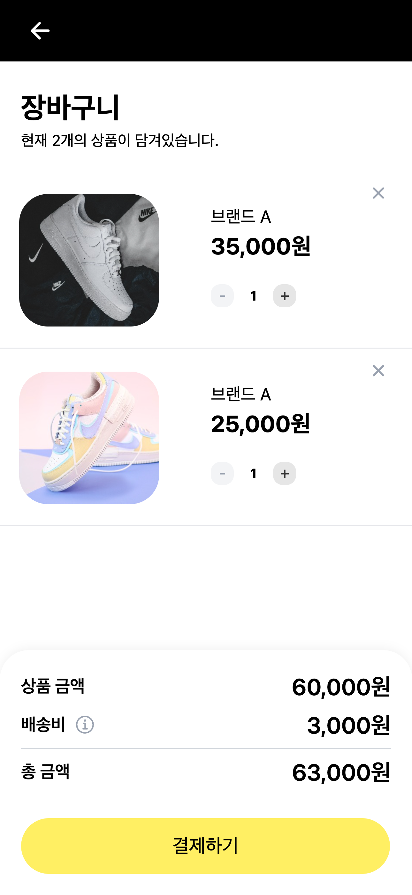
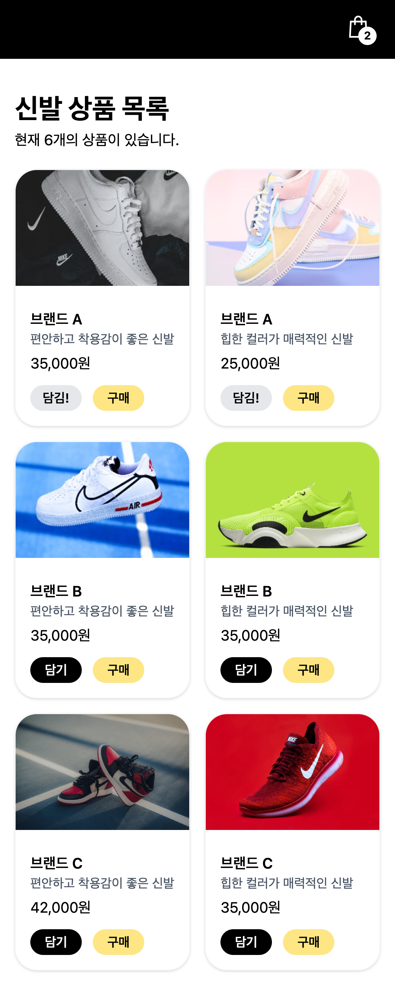
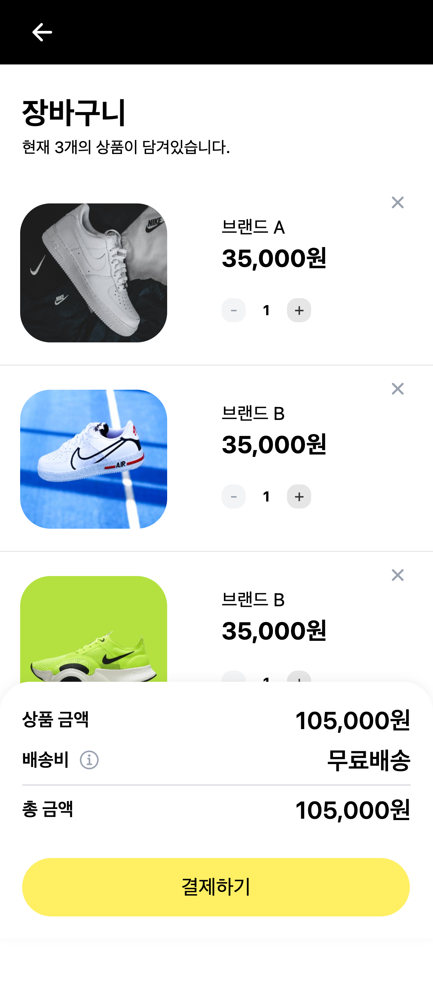
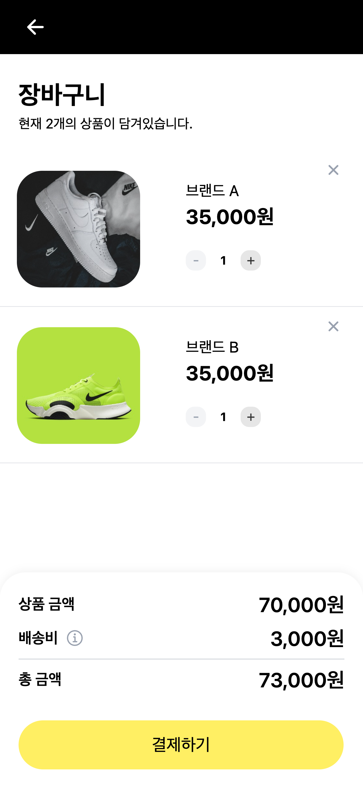

# 장바구니 페이지 리뷰

본 문서는 상품 목록 페이지 이후 단계인 장바구니 페이지의 구현 결과를 고객사 요구사항 기준으로 정리한 문서입니다.

### 배포 URL

- 테스트 URL: https://hyeonw8.github.io/shooking/

---

## 고객사 요구사항

고객사에서 전달해주신 이메일 및 피그마 시안을 기반으로 아래와 같이 요구사항을 정리했습니다.

1. 사용자가 장바구니에 담은 상품을 목록 형태로 확인할 수 있도록 해주세요.
2. 각 상품의 수량을 증가/감소할 수 있도록 해주세요.
3. 장바구니 상태에 따라 상품 금액, 배송비, 총 금액이 계산되도록 해주세요.
4. 배송비 정책(10만 원 이상 무료배송)이 적용되도록 해주세요.
5. 결제 단계로 이동할 수 있는 버튼을 제공해 주세요.
6. 이전 페이지(상품 목록)로 돌아갈 수 있도록 해주세요.
7. 작업 결과를 실제로 확인할 수 있는 테스트 URL을 제공해 주세요.

---

# 요구사항에 따른 기능 동작 확인

## 1) 장바구니 상품 목록 조회

✔ 장바구니에 담긴 상품을 리스트 형태로 확인할 수 있도록 구성했습니다.

- 상품 이미지, 브랜드명, 가격, 수량 정보를 한 화면에서 확인할 수 있도록 구성했습니다.
- 상품 목록 페이지에서 담은 상품이 장바구니 상태에 즉시 반영되며, 동일한 상태를 기반으로 목록이 구성됩니다.
- 장바구니에 상품이 없는 경우 안내 메시지와 빈 상태 화면이 표시됩니다.
  - 빈 상태에서 사용자가 다음 행동을 이어갈 수 있도록 상품 목록 페이지로 이동하는 CTA 버튼을 제공합니다.

**🛒 상품이 있는 상태**

장바구니에 상품이 담긴 상태입니다.

---

**🛒 빈 상태 화면**

장바구니가 비어 있는 상태 화면입니다.

**확인 방법**

> 상품을 장바구니에 담은 후 장바구니 페이지(`/cart`)에서 담은 상품 목록이 정상적으로 표시되는 것을 확인할 수 있습니다.

---

## 2) 상품 수량 변경 기능

✔ 각 상품의 수량을 증가/감소할 수 있도록 수량 조절 버튼을 추가했습니다.

- `+` / `-` 버튼을 통해 수량을 변경할 수 있습니다.
- 수량 변경 시 상품 금액 및 총 금액이 즉시 재계산되어 사용자에게 실시간으로 반영됩니다.
- 수량은 최소 1, 최대 99개로 제한됩니다.
- 최소/최대 수량에 도달한 경우 해당 방향의 버튼은 비활성화됩니다.

**🔢 수량 변경 전**

---

**🔢 수량 변경 후**

수량 변경 시 금액이 함께 반영되는 것을 확인할 수 있습니다.

**확인 방법**

> 수량 버튼을 클릭하여 수량이 변경되고 금액이 함께 변경되는 것을 확인하실 수 있습니다.

---

## 3) 금액 계산 기능 - 상품 금액, 총 금액

✔ 장바구니 상태에 따라 상품 금액과 총 금액이 즉시 반영되도록 구성했습니다.

- 상품 금액은 각 상품의 가격과 수량을 기준으로 계산됩니다.
- 총 금액은 상품 금액과 배송비를 포함하여 계산됩니다.
- 장바구니 상태 변경 시 별도의 추가 동작 없이 금액이 자동으로 반영되도록 구성했습니다.

**확인 방법**

> 상품 수량을 변경하거나 상품을 추가했을 때 금액이 즉시 반영되는 것을 확인하실 수 있습니다.

---

## 4) 배송비 정책 적용

✔ 배송비 정책에 맞게 배송비가 적용되도록 구성했습니다.

- 10만 원 이상 구매 시 무료배송이 적용됩니다.
- 10만 원 미만 구매 시 배송비 3,000원이 부과됩니다.
- 배송비 안내 버튼(툴팁)을 통해 정책을 확인할 수 있습니다.

**🚚 무료배송 적용 전**

상품 수량이 적어 배송비가 부과된 상태입니다.

---

**🚚 무료배송 적용 후**

상품 금액이 10만 원 이상이 되면서 무료배송이 적용된 상태입니다.
(무료배송 조건 충족 시 ‘무료배송’ 문구로 표시됩니다.)

**확인 방법**

> 상품 금액에 따라 배송비가 0원 또는 3,000원으로 즉시 변경되는 것을 확인하실 수 있습니다.

---

## 5) 결제 단계 이동

✔ 장바구니에서 '결제하기' 버튼을 통해 결제 수단 목록 페이지로 이동할 수 있도록 구성했습니다.

- 결제하기 버튼 클릭 시 결제 수단 선택 화면(/payments)으로 이동합니다.
- 장바구니에 상품이 없는 경우 버튼이 비활성화되어 결제 가능 여부를 직관적으로 인지할 수 있도록 구성했습니다.

**💳 결제 버튼 노출 상태**

---

**💳 결제 페이지 이동 결과**

결제하기 버튼 클릭 시 결제 페이지로 이동합니다.

**확인 방법**

> 장바구니에 상품이 있는 상태에서 결제하기 버튼 클릭 시 `/payments` 페이지로 이동하는 것을 확인하실 수 있습니다.

---

## 6) 뒤로가기 기능

✔ 장바구니 페이지에서 이전 페이지(상품 목록 페이지)로 이동할 수 있도록 구성했습니다.

- 상단 헤더의 뒤로가기 버튼을 통해 상품 목록 페이지로 이동할 수 있습니다.
- 사용자가 현재 흐름을 유지한 채 자연스럽게 이전 단계로 돌아갈 수 있도록 구성했습니다.

**확인 방법**

> 장바구니 페이지 상단의 뒤로가기 버튼 클릭 시 상품 목록 페이지(`/`)로 이동하는 것을 확인하실 수 있습니다.

---

## 7) 배포 URL

✔ 요청하신 대로 테스트 URL을 제공했습니다.

- 별도 설치 없이 웹 브라우저에서 바로 확인 가능합니다.
- 아래 링크 접속 후, 모든 기능의 실제 동작을 확인하실 수 있습니다.
- 배포 URL: https://hyeonw8.github.io/shooking/

---

## 추가 구현 사항

✔ 장바구니 상품 삭제 기능을 함께 구현했습니다.

- 각 상품 카드에서 삭제 버튼을 통해 개별 상품을 제거할 수 있습니다.
- 삭제 시 장바구니 상태와 금액이 즉시 반영됩니다.

**❌ 상품 삭제 전**

---

**❌ 상품 삭제 후**

상품 삭제 시 목록과 금액이 즉시 반영됩니다.

**확인 방법**

> 삭제 버튼을 클릭하면 해당 상품이 장바구니 목록에서 제거되는 것을 확인할 수 있습니다.

---

# 참고 및 향후 개선 사항

- 현재 상품 데이터는 **테스트용 mock 데이터**로 구성되어 있습니다.
- 장바구니 상태는 **브라우저 새로고침 시 초기화됩니다.**

> 본 문서는 고객사 요구사항을 기준으로 구현된 기능 동작을 정리한 문서이며, 추가 요청 사항이 있을 경우 반영하여 지속적으로 업데이트할 예정입니다.
