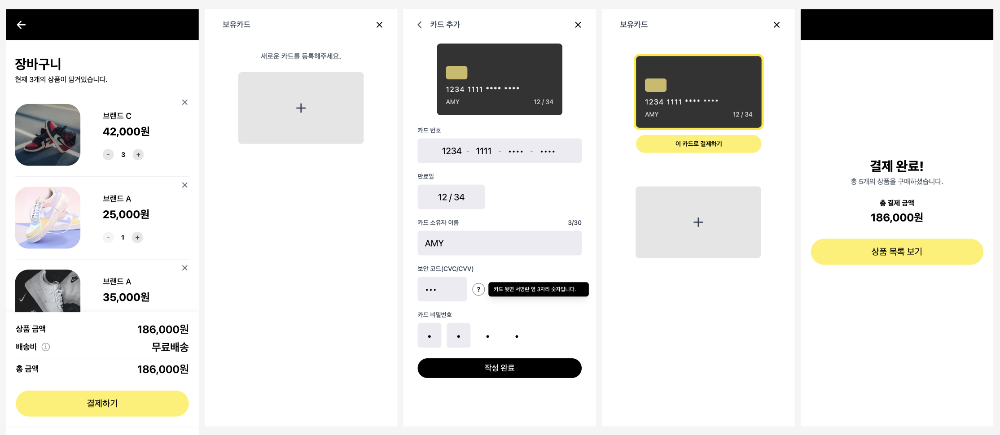
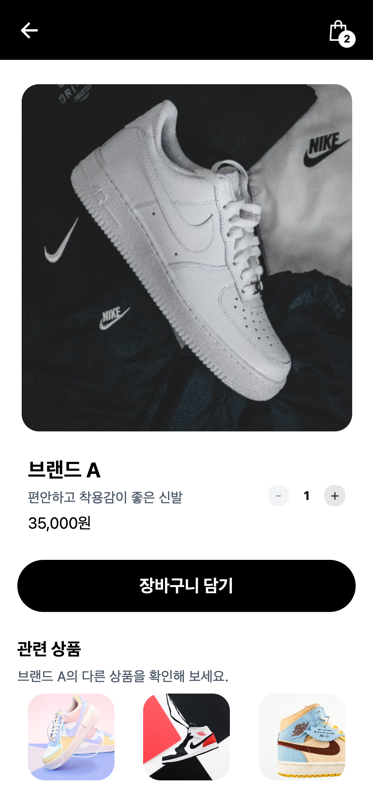
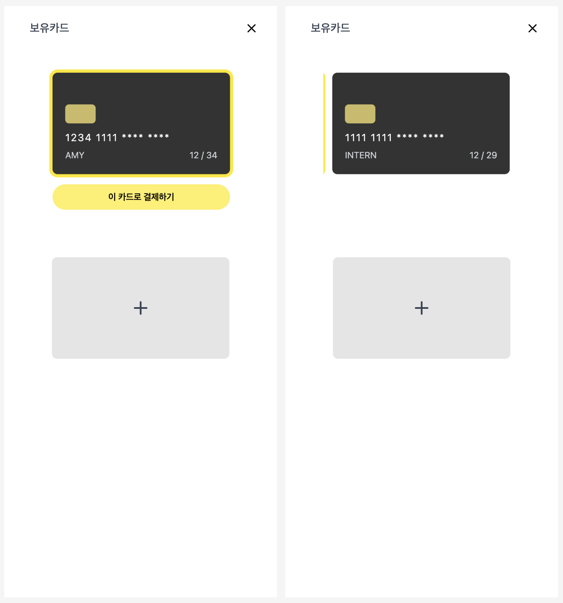
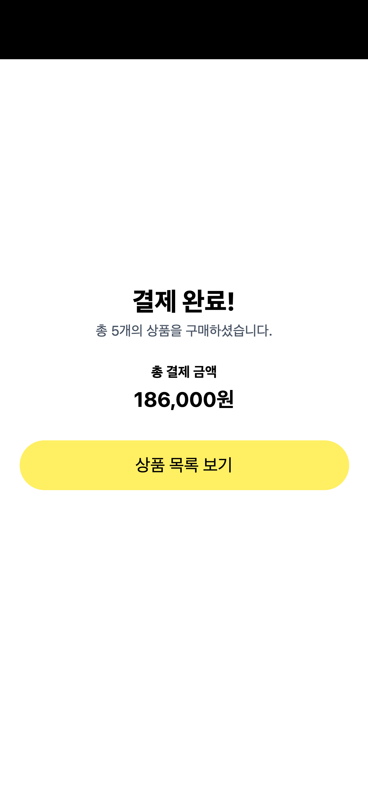

# 🛍️ shooking - 쇼핑몰 페이지 연동

작성자: hyeon (개인 프로젝트)

#### 배포 URL

- 테스트 URL: https://hyeonw8.github.io/shooking/

## 프로젝트 개요

shooking은 20~30대 젊은 세대를 타깃으로 한 패션 브랜드로,
주력 상품은 신발입니다.

본 프로젝트는 상품 목록 페이지를 시작으로 상품 상세, 장바구니, 결제 수단 선택, 카드 등록, 결제 완료까지 이어지는 전체 쇼핑 흐름을 구현한 프로젝트입니다.  
사용자가 상품을 탐색하고, 장바구니에 담고, 결제까지 자연스럽게 이어질 수 있도록 페이지 간 흐름을 연결하고, 장바구니 및 결제 관련 데이터가 일관되게 유지되도록 하는 것을 목표로 합니다.

> 상태 기반 데이터 흐름과 테스트 가능한 구조를 중심으로 설계한 프로젝트입니다.

---

### 주요 기능

- **상품 탐색 및 상세 조회**
  - 상품 목록에서 선택한 상품의 상세 정보를 확인
  - 동일 브랜드 기반 관련 상품 추천 제공
  - 장바구니에서 상품 이미지를 클릭하면 상세 페이지로 이동

- **결제 흐름 구성**
  - 결제 수단 선택 → 카드 등록 → 결제 완료까지 흐름 구성
  - 결제 시점에 장바구니 데이터를 기반으로 주문 정보 생성

- **결제 상태 관리 구조 개선**
  - 기존 Context API 기반 카드 상태를 Recoil 기반으로 전환
  - 결제 시점의 주문 정보를 관리하기 위한 `paymentOrderState`를 새로 도입
  - 페이지 간 상태 흐름이 끊기지 않도록 구조 개선
  - 카드 중복 등록 방지 로직 추가
  - 여러 카드 중 선택된 카드에만 결제 버튼 활성화 처리
  - 첫 카드 등록 시 자동 선택 기능 추가

- **상태 기반 데이터 흐름 유지**
  - 장바구니 → 결제 → 완료까지 데이터 일관성 유지
  - 페이지 이동 이후에도 상태를 기반으로 UI 유지

## 프로젝트 구조 요약

- **Recoil 기반 상태 관리 구조**
  - 결제 상태는 `paymentOrderState`를 중심으로 결제 시점의 주문 데이터를 관리
  - 카드 목록(`cardsState`)과 선택 상태(`selectedCardIdState`)를 분리하여 관리
  - 장바구니 상태는 기존 Recoil 기반 구조를 그대로 유지 (상세 내용은 `03.cart_docs.md` 참고)

- **장바구니 → 결제 흐름 분리 구조**
  - 장바구니는 상품 상태 관리에 집중
  - 결제 단계 진입 시점에 주문 스냅샷(`paymentOrderState`) 생성
  - 이후 결제 및 완료 페이지에서는 해당 주문 상태만 사용

- **액션 로직 분리 구조**
  - 상태 변경 로직은 `useCartActions`, `usePaymentActions` 훅으로 분리
  - 컴포넌트는 상태 변경을 직접 처리하지 않고 액션을 호출하는 구조

- **UI / 상태 / 로직 분리**
  - UI 컴포넌트: 렌더링 중심
  - 상태(Recoil): 전역 데이터 관리
  - utils/hooks: 상태 변경 및 비즈니스 로직 처리

- **페이지 흐름 중심 설계**
  - `/` → `/products/:id` → `/cart` → `/payments` → `/payments/success`
  - 사용자 흐름을 기준으로 페이지 간 역할을 명확히 분리

---

## 개발 환경

**Runtime**

- Node.js v20+

**Frontend**

- React 18 (Vite 기반) + React Router v7
- JavaScript (ES6+)
- Tailwind CSS

**State Management**

- Recoil

**Testing**

- Vitest
- jsdom
- React Testing Library
  - @testing-library/react
  - @testing-library/user-event
  - @testing-library/dom
  - @testing-library/jest-dom
- Storybook
- Cypress

**Deployment**

- GitHub Pages, GitHub Actions

**Environment Variables**

- 본 프로젝트는 현재 `.env` 파일 및 환경변수를 사용하지 않음

---

## 설치 및 실행 방법

1. 패키지 설치 (노드 버전 20 이상 권장)

```bash
yarn install
```

2. 개발 서버 실행

```bash
yarn dev
```

3. 프로덕션 빌드

```bash
yarn build
```

4. 빌드 결과 미리보기

```bash
yarn preview
```

## 컴포넌트 구조

### **페이지/레이아웃 흐름**

```bash
App (Router)
 ├── Home (/)
 │    ├── Header (variant="home")
 │    └── ProductCardList
 │         └── ProductCard
 │              ├── ToggleToCartButton
 │              └── BuyNowButton
 │
 ├── ProductDetailPage (/products/:id)
 │    ├── Header (variant="detail")
 │    ├── ProductDetailInfo
 │    ├── QuantityControl
 │    ├── AddToCartButton
 │    └── RelatedProducts
 │
 ├── CartPage (/cart)
 │    ├── Header (variant="cart")
 │    ├── (empty)
 │    │    └── EmptyCart
 │    └── (default)
 │         ├── PageHeaderInfo
 │         ├── CartList
 │         │    └── CartItem
 │         │         └── QuantityControl
 │         └── OrderSummary
 │              ├── AmountRow
 │              ├── ShippingFee
 │              └── CheckoutButton
 │
 ├── PaymentsPage (/payments)
 │    ├── PaymentsHeader (variant="list")
 │    ├── (empty)
 │    │    └── AddCardCTA
 │    └── (default)
 │         ├── CardList
 │         │    └── CardItem
 │         │         └── PayWithThisCardButton
 │         └── AddCardCTA
 │
 ├── AddCardPage (/payments/new)
 │    ├── PaymentsHeader (variant="add")
 │    └── AddCardForm
 │         ├── CardPreview
 │         ├── CardNumberInput
 │         ├── ExpiryInput
 │         ├── CardOwnerInput
 │         ├── CvcInput
 │         ├── CardPasswordInput
 │         └── SubmitButton
 │
 └── PaymentSuccessPage (/payments/success)
      └── Header (variant="success")
```

### **상태 관리 구조 및 흐름**

- 장바구니는 cartItemsState를 기준으로 selector를 통해 파생 상태를 계산하는 구조
- 결제는 paymentOrderState를 중심으로, 결제 시점에 생성된 주문 정보를 관리하는 구조
  - 결제 단계 진입 시 장바구니 데이터를 기반으로 주문 스냅샷을 생성하여 사용

```bash
// 장바구니 상태
cartItemsState (atom)
 ├── cartCountState
 ├── isCartEmptyState
 ├── cartSubtotalState
 ├── cartShippingFeeState
 └── cartTotalState

// 결제 수단 및 주문 상태
cardsState (atom)
selectedCardIdState (atom)
 └── selectedCardState (selector)

paymentOrderState (atom)
```

### 라우팅 구조

| 경로                | 설명             |
| ------------------- | ---------------- |
| `/`                 | 상품 목록        |
| `/products/:id`     | 상품 상세 페이지 |
| `/cart`             | 장바구니 목록    |
| `/payments`         | 보유 카드 목록   |
| `/payments/new`     | 카드 추가        |
| `/payments/success` | 결제 완료        |

> 상품 탐색 → 상세 → 장바구니 → 결제 → 완료 흐름으로 라우팅을 구성했습니다.

### **주요 컴포넌트 설명**

#### 1️⃣ 상태 관리 레이어 (state)

> 장바구니 상태(cartItemsState, 금액 selector) 관련 상세 내용은 `03.cart_docs.md` 참고

`cardsState`

등록된 카드 목록을 관리하는 atom

| 역할      | 설명                                                             |
| --------- | ---------------------------------------------------------------- |
| 원본 상태 | 등록된 카드 배열을 저장하고, 결제 수단 목록의 기준 데이터로 사용 |

- 카드 id, 카드 번호, 카드 소유자명, 유효기간 정보를 포함한 배열 형태로 관리
- 카드 등록 시 새로운 카드가 추가되며, 결제 수단 선택 페이지에서 목록 렌더링에 사용

---

`selectedCardIdState`

현재 선택된 카드 id를 관리하는 atom

| 역할      | 설명                                |
| --------- | ----------------------------------- |
| 선택 상태 | 결제 페이지에서 선택된 카드 id 관리 |

- 결제 페이지에서 사용자가 선택한 카드의 id를 저장
- 선택 상태에 따라 결제 버튼 노출 여부를 제어

---

`selectedCardState`

선택된 카드 정보를 반환하는 selector

| 역할      | 설명                                                                      |
| --------- | ------------------------------------------------------------------------- |
| 파생 상태 | `cardsState`, `selectedCardIdState`를 기반으로 현재 선택된 카드 객체 반환 |

- 현재 선택된 카드 정보를 결제 흐름에서 사용할 수 있도록 파생 상태로 제공
- 선택된 카드가 없거나 일치하는 카드가 없으면 `null` 반환

---

`paymentOrderState`

결제 시점의 주문 정보를 관리하는 atom

| 역할      | 설명                                                                |
| --------- | ------------------------------------------------------------------- |
| 결제 상태 | 결제 진입 시 생성된 주문 정보를 저장하고, 결제/완료 페이지에서 사용 |

- 장바구니 기준 결제 또는 단일 상품 구매 시 생성된 주문 정보를 저장
- 상품 목록, 상품 금액, 배송비, 총 금액을 포함한 결제용 상태로 사용|

---

---

#### 2️⃣ 액션 및 로직 레이어 (hooks / utils)

> 장바구니 액션 및 utils 관련 상세 내용은 `03.cart_docs.md` 참고

`usePaymentActions`

결제 상태 변경 액션을 제공하는 커스텀 훅

| 함수                      | 역할                  |
| ------------------------- | --------------------- |
| `handleAddCard`           | 카드 등록             |
| `handleSelectCard`        | 카드 선택             |
| `handleSetPaymentOrder`   | 결제 주문 정보 저장   |
| `handleResetPaymentOrder` | 결제 주문 정보 초기화 |

- 카드 등록 시 반환값(`isAdded`)을 통해 중복 등록 여부를 판단
- 결제 완료 후 결제 상태 초기화에 사용

---

`paymentUtils`

결제 관련 순수 함수 모음

| 함수                              | 역할                                                |
| --------------------------------- | --------------------------------------------------- |
| `addCard`                         | 카드 중복 여부를 확인한 뒤 카드 목록 갱신 여부 반환 |
| `createCartPaymentOrder`          | 장바구니 기준 주문 정보 생성                        |
| `createSingleProductPaymentOrder` | 단일 상품 구매 기준 주문 정보 생성                  |

- 장바구니 결제와 단일 상품 결제 흐름을 분리해 주문 정보 생성
- `addCard`는 카드 번호 기준 중복 여부를 확인하고, 중복이면 기존 목록을 유지
- 결제 페이지와 완료 페이지에서 사용할 데이터를 일관된 형태로 관리

---

---

#### 3️⃣ 장바구니 페이지 및 주요 UI 컴포넌트

`ProductDetailPage`

상품 상세 페이지 전체 레이아웃을 구성하는 페이지 컴포넌트

| 역할          | 설명                                                  |
| ------------- | ----------------------------------------------------- |
| 상태 조회     | route param 기반 상품 조회                            |
| 조건부 렌더링 | 존재하지 않는 상품 fallback 처리                      |
| 레이아웃 구성 | Header, 상세 정보, 장바구니 추가 버튼, 관련 상품 배치 |

- 상품 상세 정보 렌더링
- 수량 조절 및 장바구니 담기 처리
- 관련 상품 렌더링
- 장바구니 담기 시 기존 상품과 수량이 누적되도록 처리

---

`ProductDetailInfo`

상품 상세 정보 표시 컴포넌트

| Props         | 설명      |
| ------------- | --------- |
| `brand`       | 브랜드명  |
| `description` | 상품 설명 |
| `price`       | 가격      |

---

`QuantityControl`

상품 수량 증가/감소 UI 컴포넌트

| Props             | 설명                    |
| ----------------- | ----------------------- |
| `quantity`        | 현재 수량               |
| `onIncrease`      | 수량 증가 핸들러        |
| `onDecrease`      | 수량 감소 핸들러        |
| `disableIncrease` | 증가 버튼 비활성화 여부 |
| `disableDecrease` | 감소 버튼 비활성화 여부 |

- `+ / -` 버튼을 통해 수량 조절
- 최소 1, 최대 99 조건에 따라 버튼 disabled 처리

---

`AddToCartButton`

상품 상세 페이지에서 사용하는 장바구니 담기 버튼 컴포넌트

| Props     | 설명             |
| --------- | ---------------- |
| `onClick` | 버튼 클릭 핸들러 |

- 상품 상세 페이지에서 선택한 수량의 상품을 장바구니에 담는 CTA 버튼
- 실제 장바구니 추가 로직은 상위 컴포넌트에서 전달한 `onClick`으로 처리

---

`RelatedProducts`

동일 브랜드 상품 추천 컴포넌트

| Props             | 설명                                          |
| ----------------- | --------------------------------------------- |
| `brand`           | 현재 상품의 브랜드명                          |
| `relatedProducts` | 현재 상품을 제외한 동일 브랜드 상품 목록 배열 |

- 현재 상품과 동일한 브랜드의 다른 상품 목록 렌더링
- 상품 클릭 시 해당 상세 페이지로 이동
- 추천 상품이 없을 경우 렌더링하지 않음

---

`PaymentSuccessPage`

결제 완료 페이지

| 역할           | 설명                                        |
| -------------- | ------------------------------------------- |
| 주문 정보 조회 | paymentOrderState 기반 주문 정보 조회       |
| 결과 표시      | 구매 상품 수, 총 결제 금액 표시             |
| 홈 이동        | 상품 목록 보기 버튼을 통해 홈(`/`)으로 이동 |
| 상태 초기화    | 홈 이동 시 cart / payment 상태 초기화       |

- 결제 완료 후 상품 목록 보기 버튼을 통해 다시 상품 목록 페이지로 이동
- 홈 이동 시 장바구니 상태와 결제 상태를 함께 초기화
- 결제 주문 정보가 없는 경우 잘못된 접근으로 간주하고 홈(`/`)으로 리다이렉트 처리

---

#### 4️⃣ 상태 관리 전환에 따른 주요 변경 사항

`PaymentsPage`

결제 수단 선택 페이지

- 기존 `MyCardsPage`에서 컴포넌트명 변경

| 역할           | 설명                                                                   |
| -------------- | ---------------------------------------------------------------------- |
| 카드 목록 조회 | cardsState 기반 카드 목록 렌더링                                       |
| 카드 선택      | selectedCardIdState 업데이트                                           |
| 결제 진행      | paymentOrderState와 선택된 카드 여부를 확인한 뒤 결제 완료 페이지 이동 |

- 기존 Context API 기반 상태를 Recoil로 전환하여 적용
- 선택한 카드에만 `이 카드로 결제하기` 버튼 활성화
- 중복 카드 등록 시 안내 메시지가 alert 처리
- 첫 카드 등록 시 자동으로 선택되도록 구현

---

`OrderSummary`

장바구니 주문 요약 영역 컴포넌트

| 역할           | 설명                                                     |
| -------------- | -------------------------------------------------------- |
| 금액 조회      | 상품 금액, 배송비, 총 금액 상태 조회                     |
| 주문 정보 생성 | 장바구니 기준 결제용 주문 정보 생성                      |
| 결제 이동      | 결제 버튼 클릭 시 주문 정보를 저장한 뒤 `/payments` 이동 |

- 장바구니 금액 요약 영역 렌더링
- 결제 버튼 클릭 시 장바구니 정보를 기반으로 결제 시점의 주문 스냅샷 생성
- 생성한 주문 정보를 결제 페이지와 결제 완료 페이지에서 사용할 수 있도록 연결

---

`AddCardForm`

카드 등록 폼 컴포넌트

| 역할           | 설명                                                 |
| -------------- | ---------------------------------------------------- |
| 입력값 관리    | 카드 번호, 유효기간, 소유자명 등 입력값 관리         |
| 유효성 검사    | 입력 조건 충족 여부에 따라 카드 등록 가능 여부 판단  |
| 카드 등록 처리 | usePaymentActions를 통해 카드 등록 및 중복 여부 확인 |
| 페이지 이동    | 등록 성공 시 `/payments`로 이동                      |

- 기존 Context API 기반 카드 등록 로직을 제거하고 Recoil 기반 액션으로 전환
- 카드 등록 시 중복 카드 여부를 확인하고, 중복인 경우 alert로 안내 메시지 표시
- 등록 성공 시 결제 수단 선택 페이지(`/payments`)로 복귀

---

`CartItem`

장바구니 단일 상품 카드 컴포넌트

| 기능           | 설명                                           |
| -------------- | ---------------------------------------------- |
| 상품 정보 표시 | 이미지, 브랜드명, 가격 표시                    |
| 수량 변경      | `QuantityControl`을 통해 수량 조절             |
| 상품 삭제      | 삭제 버튼 클릭 시 해당 상품 제거               |
| 상세 이동      | 상품 이미지 클릭 시 해당 상품 상세 페이지 이동 |

- 상품 이미지에 상세 페이지 이동 링크를 연결
- 수량 변경 및 삭제 액션은 `useCartActions`를 통해 처리
- 상품 정보(이미지, 브랜드, 가격)와 사용자 액션(삭제, 수량 변경)을 분리한 구조로 UI 구성

---

## 테스트 방법

### 테스트 실행

#### 1) Vitest 단위 테스트 실행 (1회 실행)

```bash
yarn test        # watch 모드
yarn test:run    # 1회 실행
```

#### 2) Storybook 실행

```bash
yarn storybook
```

> 본 프로젝트는 Vitest로 상태, 유틸 함수, 컴포넌트 동작을 검증하고,  
> Storybook으로 UI 상태와 상호작용을 확인할 수 있도록 구성했습니다.

---

### 주요 UI 확인

> 개별 컴포넌트의 다양한 상태(UI 상태, 버튼 활성/비활성, 수량 변경 등)는  
> Storybook에서 확인할 수 있습니다.

#### 1. 전체 결제 흐름



> 상품 탐색 → 상세 → 장바구니 → 결제 → 완료까지의 전체 사용자 흐름

#### 2. 상품 상세 페이지



> 상품 정보 확인 및 수량 선택, 장바구니 담기/구매 흐름 진입

#### 3. 카드 선택 (상태 기반 UI)



> 선택된 카드에 따라 결제 버튼이 활성화되는 상태 기반 UI


#### 4. 결제 완료 페이지



> 결제 시점의 주문 상태(paymentOrderState)를 기반으로 결과를 표시

## 테스트 범위

### 1. 결제 유틸 함수 테스트 (`paymentUtils.test.js`)

- 카드 추가 로직 검증
  - `addCard`: 새로운 카드 등록 시 목록에 정상적으로 추가되는지 확인
  - 중복된 카드 번호 입력 시 기존 목록을 유지하고 추가되지 않는지 확인

- 주문 정보 생성 검증
  - `createCartPaymentOrder`: 장바구니 기준 주문 정보를 기대한 형태로 생성하는지 확인
  - `createSingleProductPaymentOrder`: 단일 상품 구매 기준 주문 정보를 기대한 형태로 생성하는지 확인

- 배송비 정책 검증
  - 단일 상품 구매 시 총 금액이 10만 원 이상이면 배송비가 0원으로 처리되는지 확인

### 2. 결제 상태 및 selector 테스트 (`paymentState.test.jsx`)

- 선택 카드 조회 검증
  - `selectedCardState`: 선택된 카드 id에 해당하는 카드 정보를 정상적으로 반환하는지 확인

- 예외 상태 검증
  - 선택된 카드 id가 없을 경우 `null` 기준으로 처리되는지 확인
  - 카드 목록에 없는 id를 선택한 경우 `null`을 반환하는지 확인

### 3. 결제 액션 훅 테스트 (`usePaymentActions.test.jsx`)

- 카드 등록 검증
  - 새 카드 등록 시 `cardsState`에 정상적으로 반영되는지 확인
  - 첫 카드 등록 시 `selectedCardIdState`가 자동으로 설정되는지 확인
  - 중복 카드 번호 입력 시 카드 목록이 유지되고 선택 상태가 변경되지 않는지 확인

- 카드 선택 검증
  - 카드 선택 시 `selectedCardIdState`가 변경되는지 확인

- 주문 상태 검증
  - 주문 객체를 `paymentOrderState`에 저장하는지 확인
  - 주문 초기화 시 `paymentOrderState`를 `null`로 되돌리는지 확인

### 4. 장바구니 주문 요약 테스트 (`OrderSummary.test.jsx`)

- 금액 렌더링 검증
  - 상품 금액, 배송비, 총 금액이 정상적으로 렌더링되는지 확인

- 결제 이동 검증
  - 결제하기 버튼 클릭 시 장바구니 기준 주문 정보가 생성되어 저장되는지 확인
  - 결제하기 버튼 클릭 시 `/payments`로 이동하는지 확인

- 예외 상태 검증
  - 상품 금액이 0원일 경우 결제 버튼이 비활성화되는지 확인
  - 상품 금액이 0원일 경우 클릭해도 아무 동작이 발생하지 않는지 확인

### 5. 관련 상품 테스트 (`RelatedProducts.test.jsx`)

- UI 렌더링 검증
  - 관련 상품 제목과 안내 문구가 정상적으로 렌더링되는지 확인
  - 관련 상품 이미지 목록이 정상적으로 렌더링되는지 확인

- 상세 이동 경로 검증
  - 각 관련 상품 이미지가 해당 상품 상세 페이지 경로(`/products/:id`)로 연결되는지 확인

- 빈 상태 검증
  - 관련 상품 목록이 비어 있으면 아무것도 렌더링하지 않는지 확인

### 6. 결제 완료 페이지 테스트 (`PaymentSuccessPage.test.jsx`)

- UI 렌더링 검증
  - 결제 완료 문구가 정상적으로 표시되는지 확인
  - `paymentOrderState` 기반으로 구매 상품 수와 총 결제 금액이 렌더링되는지 확인

- 상호작용 검증
  - `상품 목록 보기` 버튼 클릭 시 장바구니 상태와 결제 상태가 초기화되는지 확인
  - 버튼 클릭 시 홈(`/`)으로 이동하는지 확인

- 예외 상태 검증
  - `paymentOrderState`가 없는 경우 홈(`/`)으로 리다이렉트되는지 확인

### 7. 카드 등록 폼 테스트 (`AddCardForm.test.jsx`) - 수정 및 보완

- Context 기반 dispatch 방식에서 `usePaymentActions`의 `handleAddCard` 기반 테스트로 변경

- 중복 카드 처리 로직 변경에 따라:
  - handleAddCard의 반환값(true/false)에 따른 동작 검증 추가
  - 중복 카드일 경우:
    - alert 호출 여부 검증 추가
    - /payments로 이동하지 않는 로직 검증 추가

### 8. 장바구니 상품 카드 테스트 (`CartItem.test.jsx`) - 보완

- 상품 이미지에 `Link`가 추가되면서:
  - 상세 페이지 이동 경로(`/products/:id`) 검증 테스트 추가
- 테스트 환경에서 라우팅 처리를 위해 `MemoryRouter` 적용

---

## Storybook 스토리 구성

### 1. AddToCartButton 기본 UI (`AddToCartButton.stories.jsx`)

- Default : 장바구니 담기 버튼 기본 상태
  - 클릭 이벤트 핸들러(onClick)가 연결된 CTA 버튼

### 2. RelatedProducts 상태별 UI (`RelatedProducts.stories.jsx`)

- Default : 관련 상품 목록이 정상적으로 렌더링되는 상태
  - 동일 브랜드 상품 리스트 표시 및 상세 페이지 이동 가능
- Empty : 관련 상품이 없는 상태
  - 실제 컴포넌트는 렌더링되지 않으며, 스토리에서는 안내 메시지로 상태를 표현

### 3. PaymentSuccessPage 상태별 UI (`PaymentSuccessPage.stories.jsx`)

- Default : 여러 상품 결제 완료 상태
  - 구매 상품 수 및 총 결제 금액이 정상적으로 표시
- SingleItem : 단일 상품 결제 완료 상태
  - 단일 상품 기준 금액 및 배송비 포함 결과 표시

> Storybook은 주요 UI 상태를 독립적으로 확인하고,  
> 버튼 활성/비활성, 카드 선택 상태, 수량 조절 상태 등을 시각적으로 검증하는 용도로 사용했습니다.

---

## 유의사항 및 알려진 이슈

- 현재 상품 데이터는 **mock 데이터 기반**으로 구성되어 있습니다.
- 장바구니 및 카드 목록 상태는 브라우저를 새로고침할 경우 초기화됩니다. (추후 로컬 스토리지 또는 서버 연동으로 개선 가능)
- React 19와 Recoil 간 호환성 이슈가 있어 React 18로 조정 완료했습니다.

---

### 향후 개발 예정

- 상품 데이터 API 연결
- 컴포넌트 구조 리팩터링
- 결제 예외 처리 및 에러 핸들링 강화
- 장바구니 및 결제 상태의 영속성(localStorage / 서버 연동) 개선

---

## 참고 자료

- React 공식 문서
- Recoil 공식 문서
- React Testing Library 문서
- Storybook Docs
- Vitest 공식 문서
