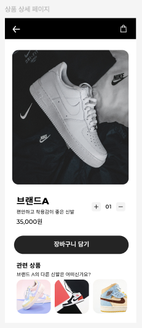
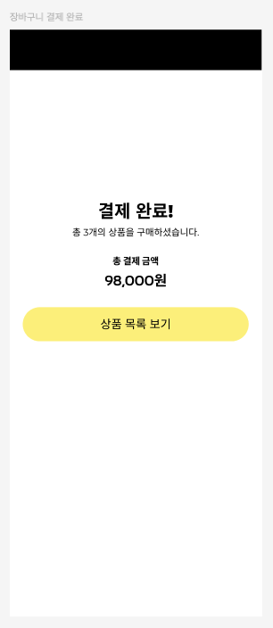

# 🛒 쇼핑몰 페이지 연동 요구사항 분석 및 기능 목록

## 📌 기본 정보

### 프로젝트명: 패션 쇼핑몰 페이지 연동 및 상품 상세 페이지

### 문서 작성자: hyeon

### 사용하게 될 기술:

- **기본**: React, JavaScript
- **상태 관리**: Recoil
- **라우팅**: React Router
- **테스트**: Vitest, Cypress
- **UI 개발 / 문서화**: Storybook
- **배포**: GitHub Pages, GitHub Actions

---

## 📝 고객 요구사항 정리

### 핵심 요구사항

- 쇼핑몰 페이지 간 자연스러운 이동 및 흐름 구성
- 페이지 이동 시 장바구니 및 결제 관련 데이터 일관성 유지
- 상품 상세 페이지 신규 도입
  - 상품 상세 정보 및 동일 브랜드 기반 관련 상품 제공
- 결제 완료 페이지 구현
- 테스트 URL 제공 후 고객사 테스트 및 피드백 진행

---

### 결정 사항

- 구현 기간: 2주
- 주요 구현 범위
  - 쇼핑몰 페이지 연동 (상품 목록 / 상품 상세 / 장바구니 / 결제 수단 목록 / 결제 수단 등록 / 결제 완료)
  - 상품 상세 페이지 구현
  - 데이터 일관성 유지 구조 설계
- 결과물
  - 테스트 URL 전달
  - 테스트 후 피드백 전달 예정

---

## 📋 기능 목록 상세 설계

### 1. 라우팅 정책 및 화면 흐름 정의

#### 라우팅 정책

- `/` : 상품 목록
- `/products/:id` : 상품 상세 페이지
- `/cart` : 장바구니 페이지
- `/payments` : 결제 수단 선택
- `/payments/new` : 카드 추가
- `/payments/success` : 결제 완료 페이지

#### 화면 흐름

**1. 상품 탐색 및 상세 진입**

- 상품 목록 조회(`/`) → 상품 카드 클릭 → `/products/:id`
- 상품 상세 페이지에서 `장바구니 담기` 클릭 → 장바구니 상태에 상품 추가
  - (선택) 상품 상세 페이지에서 `구매` 클릭 → `/payments`

**2. 장바구니 흐름**

- 공통 헤더의 장바구니 아이콘 클릭 → `/cart`
- 상품 카드 `담기` 클릭 → 장바구니 상태에 상품 추가
- 장바구니 페이지에서 상품 수량 변경 및 삭제
- 장바구니 페이지에서 `결제하기` 버튼 클릭 → `/payments`

**3. 결제 흐름**

- 상품 카드 `구매` 클릭 → `/payments`
- 카드 추가 → `/payments/new`
- 카드 등록 완료 → `/payments` 복귀
- `이 카드로 결제하기` → `/payments/success`

**4. 완료 후 흐름**

- `상품 더 보러가기` 클릭 → `/` 복귀

> 상품 탐색 → 상세 → 장바구니 → 결제 → 완료로 이어지는 전체 사용자 흐름을 기준으로 구성했습니다.

---

### 2. 상품 상세 페이지 구현

#### 기능 설명

- 상품의 상세 정보를 확인할 수 있는 페이지 제공

> 상품 상세 페이지 UI 예시

#### 세부 작업

- 상품 이미지, 브랜드명, 가격, 설명 표시
- 상품 수량 조절 기능 제공
- 장바구니 담기(토글) 버튼 제공
- 장바구니 담기 상태가 상품 목록 / 장바구니와 일관되게 반영되도록 구성
- 뒤로가기 기능 제공
- 동일 브랜드 상품 목록 표시
  - (선택) 상품 클릭 시 해당 상세 페이지로 이동
- 직접 URL 접근(`/products/:id`) 시에도 정상 렌더링되도록 처리

#### 사용 컴포넌트

- `<Header />` (variant="detail", 뒤로가기 중심 UI)
- `<ProductDetailPage />`
- `<ProductDetailInfo />`
- `<QuantityControl />`
- `<RelatedProducts />`
- `<ToggleToCartButton />`

#### 예외 처리

- 존재하지 않는 상품 id 접근 시 notFound 처리
- 데이터 로딩/에러 상태 처리

---

### 3. 브랜드 기반 상품 추천

#### 기능 설명

- 동일 브랜드 정보를 기준으로 관련 상품을 추천하여 사용자 탐색 흐름 확장

#### 세부 작업

- 현재 상품의 브랜드 정보를 기준으로 동일 브랜드 상품 목록 구성
- 상세 페이지 하단에 관련 상품 영역(`RelatedProducts`) 제공
- (선택) 추천 상품 클릭 시 해당 상품 상세 페이지(`/products/:id`)로 이동

#### 사용 컴포넌트

- `<RelatedProducts />`

#### 예외 처리

- 동일 브랜드 내 다른 상품이 없는 경우 추천 영역 미노출 또는 대체 UI(fallback) 처리

---

### 4. 페이지 연동 기능

#### 기능 설명

- 상품 탐색부터 결제 완료까지 이어지는 사용자 흐름에 맞게 페이지를 자연스럽게 연결

#### 세부 작업

- 상품 목록 → 상품 상세 페이지 이동
- 상품 상세 페이지 → 장바구니 상태에 상품 추가
- 장바구니 → 결제 수단 선택 페이지 이동
- 결제 수단 선택 → 결제 완료 페이지 이동
- 장바구니 빈 상태 → 상품 목록 페이지로 이동
- 결제 완료 → 상품 목록 페이지로 복귀

#### 사용 컴포넌트

- `<Home />`
- `<ProductDetailPage />`
- `<CartPage />`
- `<MyCardsPage />`
- `<AddCardPage />`
- `<EmptyCart />`
- `<PaymentSuccessPage />`

#### 관련 라우팅 처리

- Link / useNavigate

---

### 5. 데이터 일관성 유지

#### 기능 설명

- 페이지 간 동일한 장바구니 및 결제 관련 데이터를 유지하여 일관된 사용자 경험 제공

#### 세부 작업

- Recoil 기반 전역 상태 관리
  - 기존 결제 상태도 Context API + useReducer에서 Recoil 기반으로 전환
- 상품 상세 페이지에서 담은 상품이 장바구니 상태에 즉시 반영되도록 구성
  - 장바구니 페이지 진입 시 동일한 장바구니 상태를 기준으로 목록과 금액이 표시되도록 구성
- 결제 페이지에서도 동일한 장바구니 및 선택 카드 상태를 사용하여 주문 흐름이 끊기지 않도록 구성
- 페이지 이동 후에도 전역 상태를 기준으로 UI가 일관되게 렌더링되도록 구성

#### 사용 컴포넌트 및 관련 상태

- `<ProductDetailPage />`
- `<CartPage />`
- `<OrderSummary />`
- `<MyCardsPage />`
- `cartState.js`
  - `cartItemsState` : 장바구니 목록 상태
  - `cartSubtotalState` : 상품 금액 상태
  - `cartShippingFeeState` : 배송비 상태
  - `cartTotalState` : 총 금액 상태
- `paymentState.js`
  - `cardsState` : 보유 카드 목록 상태
  - `selectedCardState` : 선택된 카드 상태

---

### 6. 결제 완료 페이지 구현

#### 기능 설명

- 결제 완료 후 사용자에게 결과를 제공하고, 다음 행동(상품 탐색)으로 자연스럽게 이어지도록 구성

> 결제 완료 페이지 UI 예시

#### 세부 작업

- 결제 완료 메시지 및 상태 안내 UI 구성
- 결제 완료 후 상품 목록으로 이동할 수 있는 CTA 버튼 제공
- (선택) 결제 완료 이후 장바구니 상태 초기화 처리

#### 사용 컴포넌트

- `<PaymentSuccessPage />`
- `<GoShoppingButton />`

#### 예외 처리

- (선택) `/payments/success` 페이지에 직접 접근했을 때
  - 정상적인 결제 흐름이 아닌 경우 안내 메시지를 표시하거나 `/`로 리다이렉트 처리

---

### 7. 전체 UI 흐름 및 사용자 경험

#### 기능 설명

- 모든 페이지에서 일관된 UX 제공

#### 세부 작업

- 모바일 퍼스트 레이아웃 유지
- 반응형 기반 웹 레이아웃 개선
- 공용 Header 사용(home / cart / detail / payment-success)
- 뒤로가기 버튼 일관성 유지
- CTA 버튼 위치 및 스타일을 전체적으로 일관되게 유지

#### 사용 컴포넌트

- `<Header />`
- `<BackButton />`
- `<GoShoppingButton />`

---

## ✅ 검토 포인트

- 전체 페이지 간 사용자 흐름이 자연스럽게 이어지는지 확인
- 페이지 간 이동 시 장바구니 및 결제 상태가 일관되게 유지되는지 확인
- 결제 완료 후 사용자 흐름이 상품 탐색으로 자연스럽게 이어지는지 확인
- (선택) 상품 상세 페이지 직접 접근 시 예외 처리가 정상 동작하는지 확인

---

## 📌 향후 확장 고려 사항 (선택 사항)

### 기능 확장

- 상품 리뷰 및 평점 기능 추가
- 검색 및 필터 기능 추가
- 테스트용 결제 API 연동

### 구조 및 품질 보완

- 결제 페이지와 주문 데이터 연동 구조 상세화
- 로딩 및 에러 상태 처리 보완
- 장바구니 상태 유지 방식(localStorage 등) 적용
- 상품 데이터 서버 API 연동
- 보유 카드 목록 UI 및 렌더링 방식 개선
