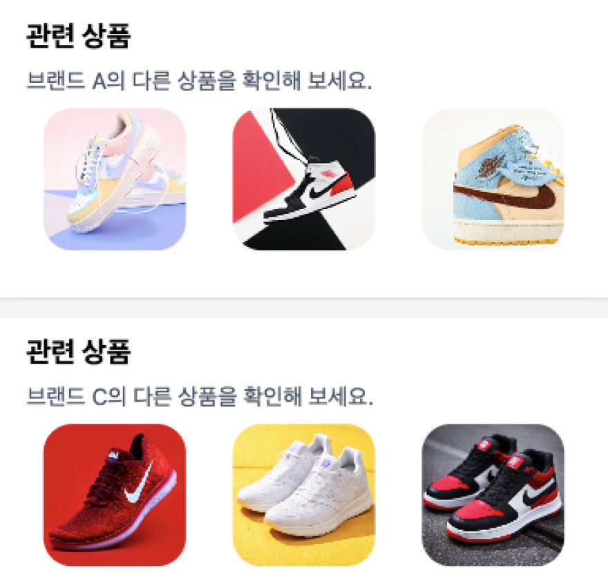
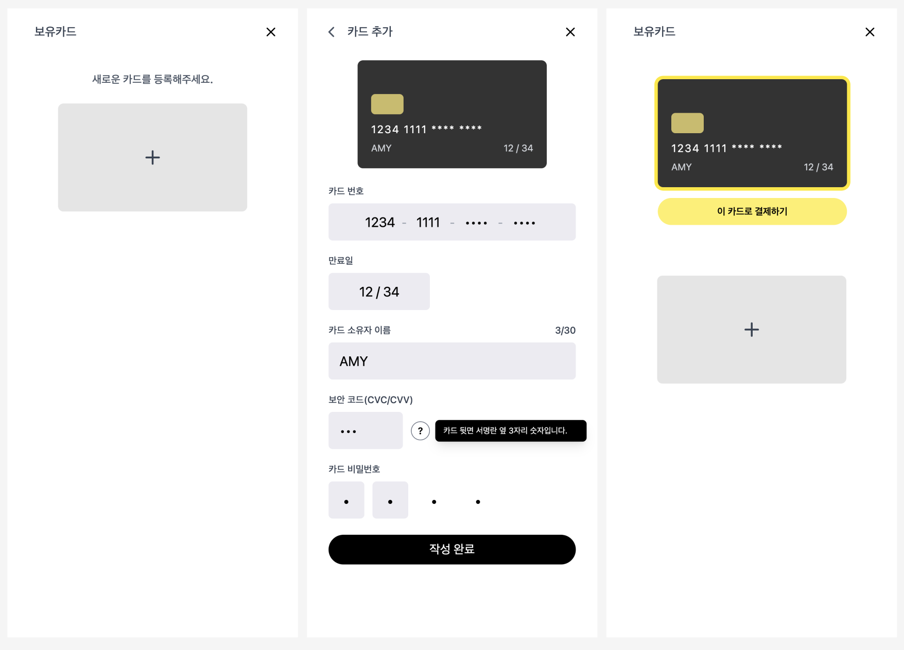

# 쇼핑몰 페이지 연동 및 상품 상세 페이지 리뷰

본 문서는 상품 목록 페이지 이후 단계인 상품 상세 페이지, 장바구니, 결제 수단 선택, 카드 등록, 결제 완료 페이지까지의  
구현 결과를 고객사 요구사항 기준으로 정리한 문서입니다.

### 배포 URL

- 테스트 URL: https://hyeonw8.github.io/shooking/

---

## 고객사 요구사항

고객사에서 전달해주신 이메일 및 피그마 시안을 기반으로 아래와 같이 요구사항을 정리했습니다.

1. 쇼핑몰 페이지 간 자연스러운 이동 및 흐름이 가능하도록 구성해 주세요.
2. 페이지 이동 시 장바구니 및 결제 관련 데이터가 일관되게 유지되도록 해주세요.
3. 상품 상세 페이지를 신규 도입해 주세요.

- 상품 상세 정보 제공
- 장바구니 담기 기능 제공
- 동일 브랜드 기반 관련 상품 추천 제공

4. 결제 완료 페이지를 구현해 주세요.
5. 테스트 URL을 제공해 주세요.

---

# 요구사항에 따른 기능 동작 확인

## 1) 페이지 간 이동 및 전체 사용자 흐름 구성

✔ 상품 탐색부터 결제 완료까지 이어지는 전체 사용자 흐름을 자연스럽게 연결했습니다.

- 상품 목록(/)에서 상품 클릭 시 상품 상세 페이지(/products/:id)로 이동할 수 있도록 구성했습니다.
- 공통 헤더의 장바구니 버튼을 통해 장바구니 페이지(/cart)로 이동할 수 있도록 구성했습니다.
- 장바구니 페이지의 결제하기 버튼 클릭 시 결제 수단 선택 페이지(/payments)로 이동합니다.
- 카드 등록 완료 후 다시 결제 수단 선택 페이지(/payments)로 복귀하도록 연결했습니다.
- 이 카드로 결제하기 클릭 시 결제 완료 페이지(/payments/success)로 이동합니다.
- 결제 완료 페이지에서 상품 목록 보기 버튼을 통해 다시 상품 목록(/)으로 돌아갈 수 있도록 구성했습니다.

**🔄 전체 결제 흐름**

**확인 방법**

> 상품 목록 → 상품 상세 → 장바구니 → 결제 수단 선택 → 결제 완료 흐름이 정상적으로 연결되는지 테스트 URL에서 확인할 수 있습니다.

---

## 2) 상품 상세 페이지 구현

✔ 상품 상세 정보를 확인할 수 있는 전용 페이지를 구현했습니다.

- 상품 이미지, 브랜드명, 설명, 가격 정보를 한 화면에서 확인할 수 있도록 구성했습니다.
- 수량 조절 기능을 추가하여 사용자가 원하는 수량만큼 담을 수 있도록 구성했습니다.
- 장바구니 담기 버튼을 통해 현재 선택한 수량만큼 장바구니에 추가할 수 있도록 구현했습니다.
  - 이미 장바구니에 담긴 상품을 다시 담을 경우 수량이 누적되도록 처리했습니다.
- 페이지 하단에 동일 브랜드의 다른 상품 추천을 확인할 수 있도록 배치했습니다.
- 상단 헤더에 뒤로가기 버튼을 두어 이전 흐름으로 자연스럽게 복귀할 수 있도록 구성했습니다.
- 존재하지 않는 상품 id로 접근한 경우 안내 메시지 화면이 표시되도록 처리했습니다.

**🛍 상품 상세 페이지**

상품 이미지, 상품 정보, 수량 조절 및 장바구니 담기 기능, 관련 상품 목록을 확인할 수 있습니다.

**확인 방법**

> 상품 목록에서 상품을 클릭하거나 `/products/:id` 경로로 접근하여 상세 정보가 정상적으로 표시되는지 확인할 수 있습니다.

---

## 3) 동일 브랜드 기반 상품 추천

✔ 현재 보고 있는 상품과 동일한 브랜드의 다른 상품을 추천 영역으로 제공했습니다.

- 현재 상품의 브랜드 정보를 기준으로 관련 상품 목록을 구성했습니다.
- 상품 상세 페이지 하단에 관련 상품 영역을 배치하여 탐색 흐름이 자연스럽게 이어지도록 구성했습니다.
- 추천 상품 클릭 시 해당 상품의 상세 페이지(/products/:id)로 이동하도록 연결했습니다.
- 동일 브랜드의 다른 상품이 없는 경우 추천 영역이 노출되지 않도록 처리했습니다.

**🔗 관련 상품 추천 영역**

상품 상세 페이지 하단에서 동일 브랜드 상품 추천 영역을 확인할 수 있습니다.

**확인 방법**

> 상품 상세 페이지 하단의 관련 상품 이미지를 클릭했을 때 해당 상품 상세 페이지로 이동하는지 확인할 수 있습니다.

---

## 4) 장바구니 및 결제 상태의 데이터 일관성 유지

✔ 페이지 간 이동 시 장바구니 및 결제 관련 데이터가 일관되게 유지되도록 구성했습니다.

- 상품 상세 → 장바구니 → 결제 단계까지 상품 정보와 금액이 자연스럽게 이어지도록 구성했습니다.
- 카드 등록 및 선택 상태가 페이지 이동 이후에도 유지되도록 구성했습니다.
- 결제 완료 후 홈으로 이동할 때 장바구니 상태와 결제 상태가 함께 초기화되도록 처리했습니다.

**확인 방법**

> 상품 담기 → 장바구니 이동 → 결제 수단 선택 → 결제 완료까지 진행했을 때 상태가 끊기지 않고 이어지는지 확인할 수 있습니다.

---

## 5) 결제 수단 선택 및 카드 등록 기능

✔ 기존 결제 모듈을 기반으로 카드 등록 및 선택 흐름을 개선하고, 상태 관리 구조를 정리했습니다.

- 기존 기능
  - /payments 페이지에서 등록된 카드 목록을 확인할 수 있습니다.
  - 카드가 없는 경우 안내 메시지와 함께 카드 추가 CTA를 제공합니다.
  - /payments/new 페이지에서 카드 정보를 입력해 새 카드를 등록할 수 있습니다.
- 개선 사항
  - 중복 카드 등록 시 안내 메시지가 표시되도록 처리했습니다.
  - 선택된 카드에만 결제 버튼이 노출되도록 구성했습니다.
  - 첫 카드 등록 시 자동으로 선택되도록 상태를 연결했습니다.
  - 상태 관리 구조를 개선하여 페이지 간 흐름이 더욱 자연스럽게 이어지도록 했습니다.

**💳 카드 등록/선택 흐름**

결제 수단 선택 페이지에서 등록 카드 확인 및 결제 진행이 가능합니다.  
카드 등록 완료 후 보유 카드 목록으로 복귀되며,
등록된 카드가 즉시 목록에 반영됩니다.

---

**💳 카드 선택 전 / 후**

선택된 카드에만 결제 버튼이 노출되도록 구성했습니다.

**확인 방법**

> 카드가 없는 상태에서 `/payments/new`로 이동해 카드를 등록한 뒤, `/payments`에서 선택 후 결제 완료 페이지로 이동하는지 확인할 수 있습니다.  
> 카드가 선택되지 않았거나 결제에 필요한 정보가 없는 경우 결제가 진행되지 않는지 확인할 수 있습니다.

---

## 6) 결제 완료 페이지 구현

✔ 결제 완료 후 사용자에게 결과를 안내하고, 다음 행동으로 자연스럽게 이어지도록 했습니다.

- 결제 완료 메시지를 표시하여 결제가 정상적으로 완료되었음을 안내했습니다.
- 결제에 사용된 주문 데이터를 기준으로 구매 상품 수와 총 결제 금액이 표시되도록 구성했습니다.
- 상품 목록 보기 버튼을 통해 다시 상품 목록 페이지로 이동할 수 있도록 구성했습니다.
- 상품 목록으로 이동할 때 장바구니 상태와 결제 상태를 함께 초기화하도록 처리했습니다.

**✅ 결제 완료 페이지**

결제 완료 후 구매 상품 수와 총 결제 금액을 확인할 수 있습니다.

**확인 방법**

> 결제 수단 선택 페이지에서 결제를 완료한 뒤 `/payments/success` 페이지에서 구매 수량 및 총 결제 금액이 정상적으로 표시되는지 확인할 수 있습니다.

---

## 7) 배포 테스트 URL 제공

✔ 요청하신 대로 실제 동작을 확인할 수 있는 테스트 URL을 제공했습니다.

- 별도 설치 없이 웹 브라우저에서 바로 확인 가능합니다.
- 아래 링크를 통해 상품 탐색부터 결제 완료까지의 흐름을 직접 테스트할 수 있습니다.
- 배포 URL: https://hyeonw8.github.io/shooking/

---

## 추가 구현 사항

✔ 요구사항 외에도 사용자 경험과 상태 흐름을 고려한 기능을 함께 구현했습니다.

- 장바구니 페이지에서 상품 이미지를 클릭하면 상세 페이지로 이동하도록 처리했습니다.
- 카드 등록 시 첫 카드 자동 선택 로직을 반영했습니다.
- 결제 완료 후 홈으로 돌아갈 때 장바구니 상태 및 결제 상태를 함께 초기화하도록 구성했습니다.

---

# 참고 및 향후 개선 사항

- 현재 상품 데이터는 **테스트용 mock 데이터**로 구성되어 있습니다.
- 실제 결제 API 연동은 아직 적용하지 않았습니다.
- 장바구니 상태는 **브라우저 새로고침 시 초기화됩니다.**
- 일부 선택 기능은 향후 확장 범위로 남겨두었습니다.
  - 상품 상세 페이지에서 바로 구매 버튼을 통한 결제 진입
  - /payments/success 직접 접근 시 예외 처리
  - 결제 페이지 UI/플로우 고도화

> 본 문서는 고객사 요구사항을 기준으로 구현된 기능 동작을 정리한 문서이며, 추가 요청 사항이 있을 경우 반영하여 지속적으로 업데이트할 예정입니다.
